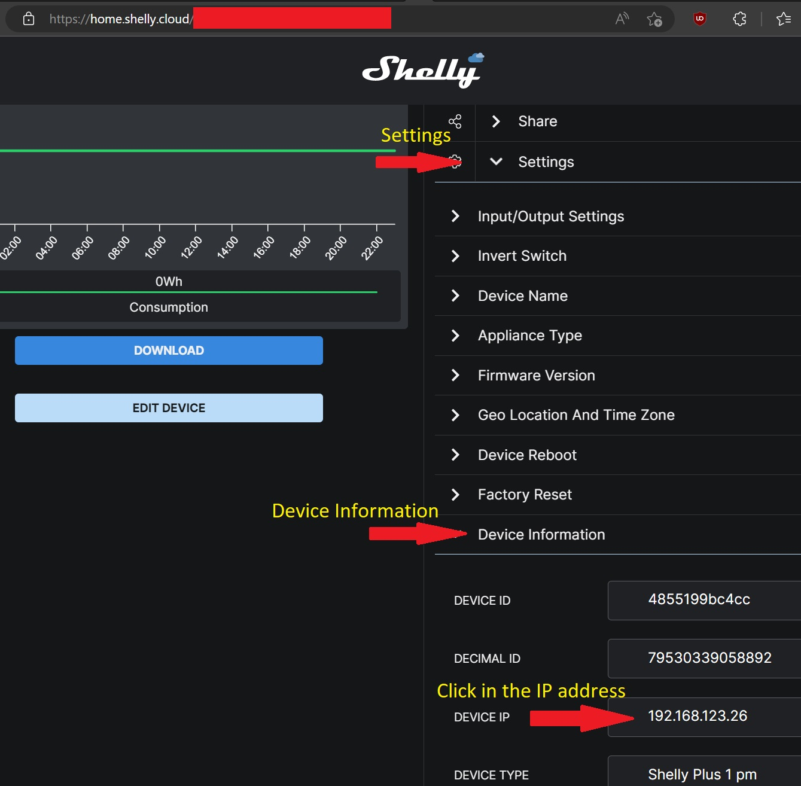
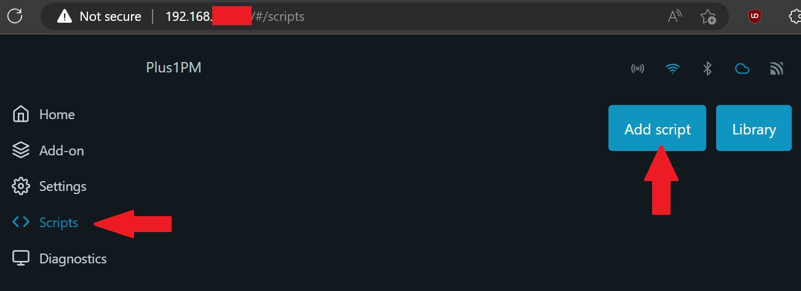
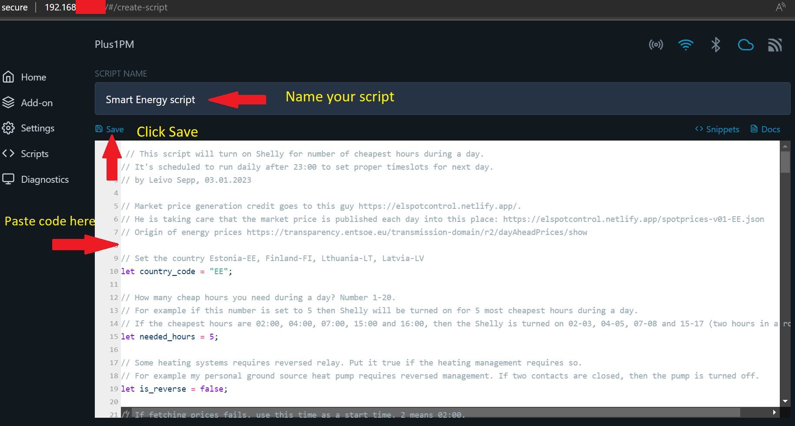
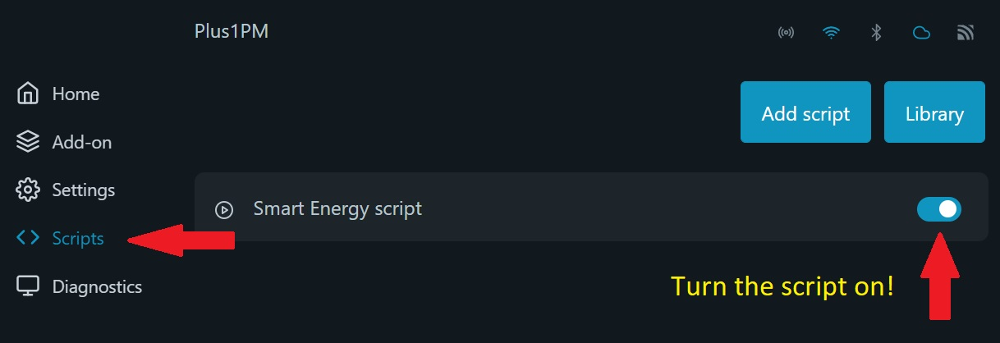
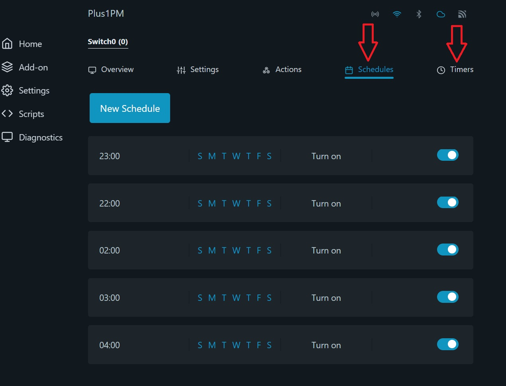
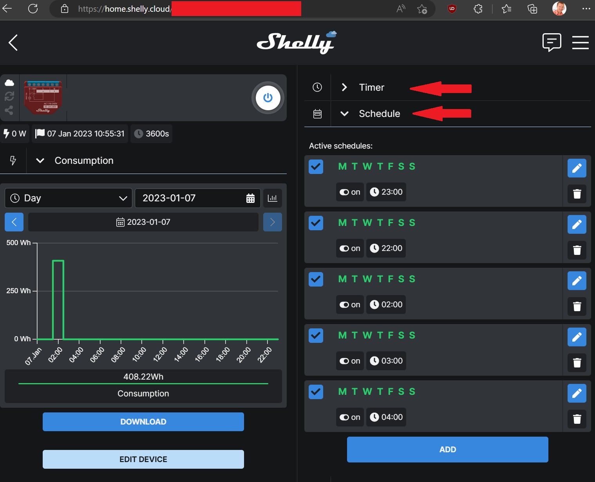

# This is an old version of the script

**IMPORTANT**

This script not using temperature forecast to calculate heating curve. I suggest to use the latest one [here](https://github.com/LeivoSepp/Smart-heating-management-with-Shelly)

# (OLD) Smart energy price for Shelly (OLD)

## What does this script doing?
This script will turn on [Shelly Pro/Plus devices](https://www.shelly.cloud/en-ee/products/) for number of cheap hours during a day based on the [energy market price](https://www.nordpoolgroup.com/en/Market-data1/Dayahead/Area-Prices/ALL1/Hourly/). 

Your household electric bill will be smaller if you use the energy hungry appliances in cheapest time of a day. Some of the energy hungry appliances are water heater, air-source or ground-source heatpump, electric radiator, underfloor electric heater and air conditioning.  

You will only benefit from this in case of having energy contract with hourly market price. If your energy contract has one flat rate, then this solution will not help to redure your energy bill.

## How to use this script?
1. Go and buy any [Shelly Pro/Plus devices](https://www.shelly.cloud/en-ee/products/). Shelly device must be a [Gen 2 device](https://shelly-api-docs.shelly.cloud/gen2/) to support scripting. Let's make it simple, the name must contain *Plus* or *Pro*. 
2. Connect Shelly device to WiFi network. [Shelly web interface guides.](https://kb.shelly.cloud/knowledge-base/web-interface-guides)
3. Find Shelly IP address and go to page (put your own IP address) http://192.168.33.1/#/script/1
4. Add script, just copy the [script](https://github.com/LeivoSepp/Smart-energy-price-for-Shelly/blob/master/EnergyPriceScriptForShelly.js) and paste it to Shelly scripting window.
5. Configure following script parameters:
    - Set the country code. Possible values: Estonia-ee, Finland-fi, Lthuania-lt, Latvia-lv. ``country_code = "ee"``
    - Set the number of cheap hours required during a day. Values in range 1-20. ``needed_hours = 5``  
    - Set relay mode - normal or reversed. Values true/false. ``is_reverse = false``. 99% of the cases this parameter should be false. Don't change it.
    - Set default start time which is used if getting energy pricec from the internet is failed. Values in range 0-23.  ``default_start_time = 1``
6. Click "Save" and "Start". 

## How to add script into Shelly
Shelly IP address can be found under Setting - Device Information - Device IP. Just click on the IP address and new Shely window will open.

- In Shelly page click "Scripts" and "Add script".

- Give a name to the script.
- Copy the code from this [page](https://github.com/LeivoSepp/Smart-energy-price-for-Shelly/blob/master/EnergyPriceScriptForShelly.js).  
- Paste the text into script window.
- Click Save.

* Click "Start"!
* Click "Scripts" to go back into scipts list.
* Enable the script to run automatically in each day.

## How can I see the outcome?

In Shelly page click "Home" and then click "Switch0" and then find "Schedules" and "Timers".

The schedulers can be seen also in page https://home.shelly.cloud/.

## How this script works?

1. This script requires internet connection as it needs to download energy market prices in each day.
2. After first run, the script creates a schedule for itself and runs daily basis between 23:00-23:15.
3. If the script was able to download energy prices, then the script:

    1. finds number of cheapest hours from a day based on ``needed_hours = 5`` parameter,
    2. creates number of schedules to turn on Shelly,
    3. creates automatic 1 hour countdown timer to turn off Shelly.

Example:

> If ``needed_hours = 5`` then Shelly is switched on for the 5 cheapest hours in a day. 
If cheapest hours are 02:00, 04:00, 07:00, 15:00 and 16:00, then Shelly is turned on for 02-03, 04-05, 07-08 and 15-17 (two hours in a row).

4. If the script wasn't able to get the energy prices from the internet, then the script:

    1. creates just one schedule which start at the time set by parameter ``default_start_time = 1``
    2. creates automatic countdown timer with the length of ``neede_hours = 5`` to turn off Shelly. 

Example:

> If ``default_start_time = 1`` and ``needed_hours = 5``, then Shelly is switched on for 01:00-06:00. 

5. Some heating systems requires reversed relay. Put ``is_reverse = true`` if this is the case for your heating system.
For example my personal ground-source heatpump is requires the reversed management.

## Where we get the market prices?

Energy Market price is downloaded from [Elering API](https://dashboard.elering.ee/assets/api-doc.html#/nps-controller/getPriceUsingGET). 

