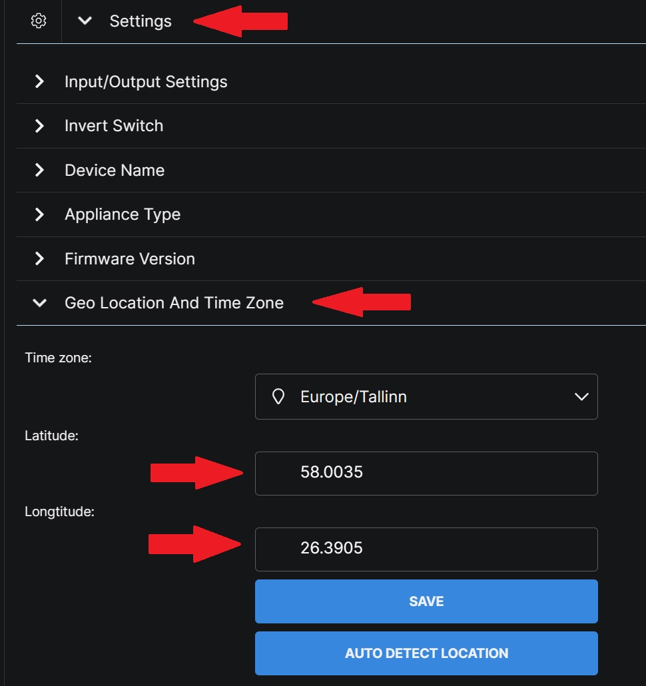
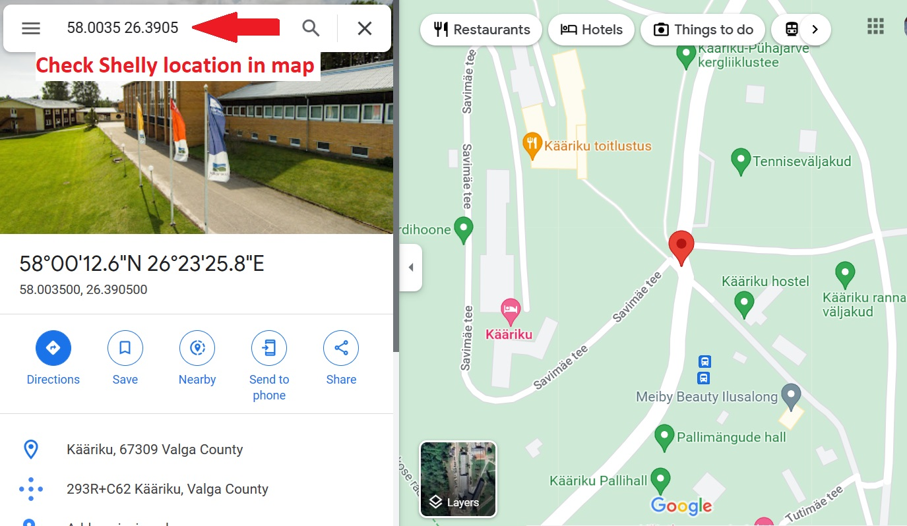
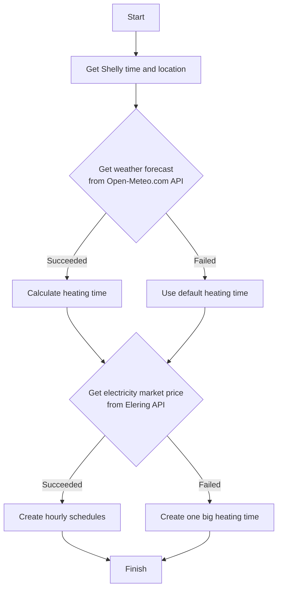

# Smart heating management with Shelly

## What does this script doing?
This script is calculating required heating time based on [weather forecast](https://open-meteo.com/), and turns on your heating system for cheapest hours in a day based on [electricity market price](https://dashboard.elering.ee/et/nps/price).

It's scheduled to run daily after 23:00 to set heating schedule for next day.

This script works with [Shelly Pro/Plus devices](https://www.shelly.cloud/en-ee/products/) which supports scripting.

This script depends on two services:
* electricity market price from [Elering API](https://dashboard.elering.ee/assets/api-doc.html#/nps-controller/getPriceUsingGET),
* weather forecast from [Open-Meteo API](https://open-meteo.com/en/docs).

## Does it really reduce my electric bills?

Short answer: yes.

Long answer. Your overall daily electric consumption will stay same, but this script will turn on your heating devices for cheapest hours. 

Thats why the electricity bill is smaller even you consume same amount of energy.

Some of the energy hungry appliances are water heater, air-source or ground-source heatpump, electric radiator, underfloor electric heater, air conditioning and it makes sense to turn them on during cheapest time of a day.

Electicity price can vary sometimes 100 times during a day. Check  [electricity market prices](https://dashboard.elering.ee/et/nps/price).

**IMPORTANT**

> You will only benefit in case of having hourly priced energy contract. If your energy contract has one flat rate, then this solution will not help to redure your energy bill.

This will work for Estonia-ee, Finland-fi, Lthuania-lt and Latvia-lv.
Electricity market prices for other countries do not exist in Elering API.

Set your country parameter ``country = "ee"``.

## Why the heating hours are based on weather forecast?

If outside temperature is +20 degrees, you don't need heating. This is so true.

If temperature is -5 degrees you need some heating but for -20 degrees you need much more heating. This is also true.

Now you got why weather forecast is very important for calculating next day heating time. This is a smart way to manage heating system.

To get your home weather forecast, location data is needed. 

**IMPORTANT**

> Please make sure your Shelly device has correct location. Shelly - Settings - Geolocation - Latitude/Longitude.

> Shelly location is based on your internet provider IP-address and it is very likely not your home location.

Copy values from latitude and longitude fields and put them into googl maps to know which place is identified by Shelly.

If you are not satisfied with the Shelly identified location then put a pin into googl maps, copy latitude/longitude and overwrite your Shelly location.

The temperature and heating time relationship is called **heating curve**.

## How the heating curve looks like?

Heating time is based on your household insulation. For example an old and not insulated house needs 10 h heating if outside is -5 degrees, while new A-class house might need only 4 hours.

This is the reason the scipt has parameter ``heatingCurve`` which is used to set the best heating curve for each household.  

This graph shows how the heating time is dependent on temperature and a parameter ``heatingCurve``.

**IMPORTANT**

> You can start using this script with the default ``heatingCurve = 5``, and take a look how this works for you. If you feel cold, then increase this number. If you feel too warm, then decrease this number. 

If you like math, then this is the quadratic equation to calculate heating time: ``(startingTemp-avgTemp)^2 + (heatingCurve / powerFactor) * (startingTemp-avgTemp)``.

* ``startingTemp = 10 `` is used as starting point for heating curve.
* ``avgTemp = -5 `` is the average next day temperature forecast.
* ``heatingCurve = 5 `` is used to set the best heating curve for your household.
* ``powerFactor = 0.2 `` is used to set quadratic equation parabola curve flat or steep.

You can build your own heating curve equation if you feel comfortable to do so.

Sidenote! Shelly scripting has a technical limitations and this is the reason of having maximum number of hours 20 and not 24. If Shelly will change the RPC call limitation in future then this script can be easily modified to support 24 hours.

## How to use this script?

1. Go and buy any [Shelly Pro/Plus devices](https://www.shelly.cloud/en-ee/products/). Shelly device must be a [Gen 2 device](https://shelly-api-docs.shelly.cloud/gen2/) to support scripting. Let's make it simple, the name must contain *Plus* or *Pro*. 
2. Connect Shelly device to WiFi network. [Shelly web interface guides.](https://kb.shelly.cloud/knowledge-base/web-interface-guides)
3. Find Shelly IP address and go to page (put your own IP address) http://192.168.33.1/#/script/1
4. Add script, just copy the [script](https://github.com/LeivoSepp/Smart-heating-management-with-Shelly/blob/master/SmartHeatingWidthShelly.js) and paste it to Shelly scripting window.
5. Configure required parameters:
    - Set the country code. Possible values: Estonia-ee, Finland-fi, Lthuania-lt, Latvia-lv. ``country = "ee"``
    - Set heating curve based on your household: ``heatingCurve = 5``
6. Configure optional parameters:
    - Set the number of cheap hours required during a day. This is used in case the weather forecast can't be get. Values in range 1-20.  ``heatingTime = 5``  
    - Set default start time which is used in case get energy price is failed. Values in range 0-23.  ``default_start_time = 1``
    - Set relay mode - normal or reversed. Values true/false. ``is_reverse = false``. 99% of the cases this parameter should be false. Don't change it.
7. Click "Save" and "Start". 

## How to add script into Shelly

Shelly IP address can be found under Setting - Device Information - Device IP. Just click on the IP address and new Shely window will open.

- In Shelly page click "Scripts" and "Add script".

- Give a name to the script.
- Copy the code from this [page](https://github.com/LeivoSepp/Smart-energy-price-for-Shelly/blob/master/SmartHeatingWidthShelly.js).  
- Paste the text into script window.
- Click Save.

* Click "Start"!
* Click "Scripts" to go back into scipts list.
* Enable the script to run automatically in each day.

## How can I see the outcome?

In Shelly page click "Home" and then click "Switch0" and then find "Schedules" and "Timers".

The schedulers can be seen also in page https://home.shelly.cloud/.

## How this script works?

1. This script requires internet connection to download daily basis electricity market prices and weather forecast.
2. After first run, the script creates a schedule for itself and runs daily basis between 23:00-23:15.
3. The script follows this flowchart.

