# Smart and cheap heating with Shelly

- [Smart and cheap heating with Shelly](#smart-and-cheap-heating-with-shelly)
  - [Script Overview](#script-overview)
  - [Configuring Script parameters](#configuring-script-parameters)
    - [Using Shelly App](#using-shelly-app)
    - [Using Shelly KVS](#using-shelly-kvs)
  - [Important To Know](#important-to-know)
  - [Tested Failure Scenarios](#tested-failure-scenarios)
- [Smart Heating Algorithms](#smart-heating-algorithms)
  - [Weather Forecast Algorithm](#weather-forecast-algorithm)
    - [Advantages of Weather Forecast-Based Heating](#advantages-of-weather-forecast-based-heating)
    - [Shelly Geolocation](#shelly-geolocation)
    - [Heating Curve](#heating-curve)
  - [Time Period Algorithm](#time-period-algorithm)
- [Does it Truly Reduce My Electric Bills](#does-it-truly-reduce-my-electric-bills)
- [How to Install this Script](#how-to-install-this-script)
  - [Installation](#installation)
  - [Updating Script](#updating-script)
  - [How to Verify Script Execution](#how-to-verify-script-execution)
  - [How the Script Operates](#how-the-script-operates)
- [Troubleshooting](#troubleshooting)
  - [Message "This schedule contains invalid call method or params"](#message-this-schedule-contains-invalid-call-method-or-params)
  - [Message "Id3: #1 Scheduler at: 12:00 price: 185.91 EUR/MWh (energy price + transmission). FAILED, 20 schedulers is the Shelly limit."](#message-id3-1-scheduler-at-1200-price-18591-eurmwh-energy-price--transmission-failed-20-schedulers-is-the-shelly-limit)
  - [Error "Couldn't get script"](#error-couldnt-get-script)
  - [Advanced → Key Value Storage → Script Data](#advanced--key-value-storage--script-data)

## Script Overview
This Shelly script is designed to optimize heating activation by leveraging energy market prices from Elering, ensuring heating operates during the most cost-effective hours using various algorithms.

Key Features:
1. **Dynamic Heating Time Calculation**:
Calculates optimal heating times for the next day based on weather forecasts and energy prices.

2. **Time Period Division**:
Divides the day into time periods and activates heating during the cheapest hour within each period.

3. **Price-Level Utilization**:
Employs minimum and maximum price thresholds to keep the Shelly system consistently on or off based on cost efficiency.

**Execution Schedule**:
The script runs daily after 23:00 or as necessary during the day to set up heating time slots for the upcoming period.    

## Configuring Script parameters

### Using Shelly App 
This script supports Shelly Virtual Components, allowing script parameters to be modified remotely using the Shelly app on a mobile phone.

Virtual Components are supported on Shelly Gen 2 Pro devices, as well as all newer Gen 3 and later devices.

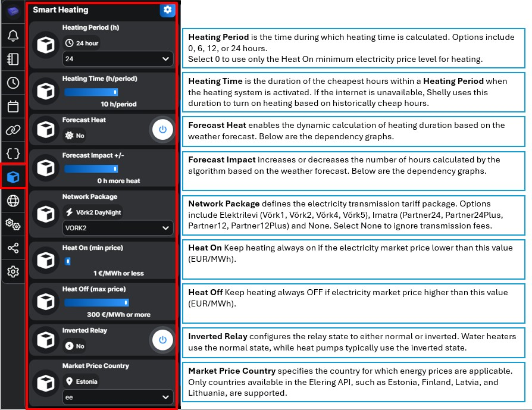

### Using Shelly KVS 
For older Shelly devices that do not support Virtual Components, all parameters are saved to the Shelly KVS store. These settings can be modified directly via the Shelly web interface.

To update them, access the Shelly device via its IP address, navigate to **Menu &rarr; Advanced &rarr; KVS**, and locate the desired settings.

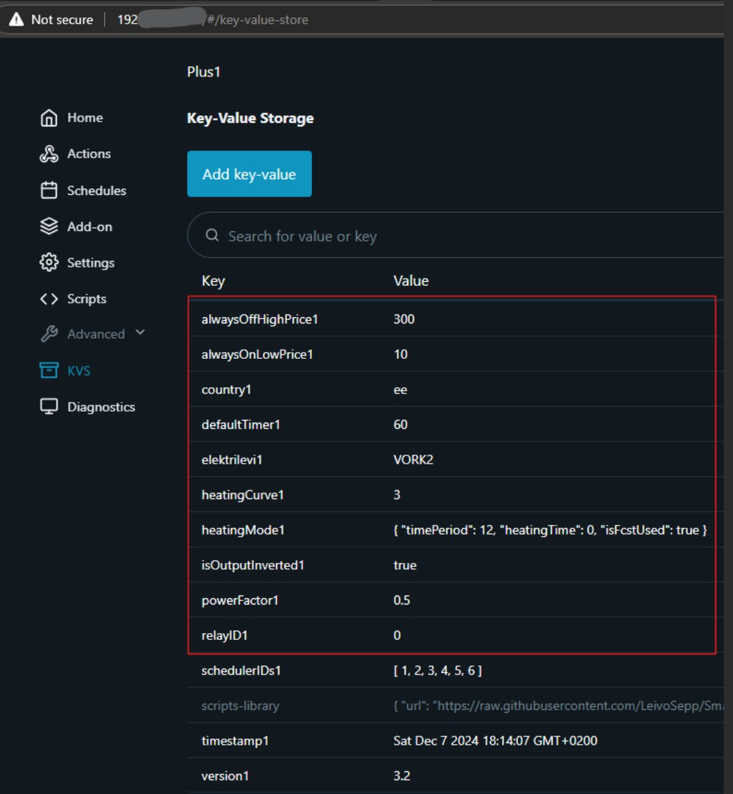

1. ``alwaysOffHighPrice: 300`` - Keep heating always OFF if electricity market price higher than this value (EUR/MWh).

2. ``alwaysOnLowPrice: 10`` - Keep heating always on if the electricity market price lower than this value (EUR/MWh).

3. ``country: ee`` - Specifies the country for energy prices. Only countries available in the Elering API are supported.
 
    * ``ee`` - Estonia
    * ``fi`` - Finland
    * ``lt`` - Lithuania
    * ``lv`` - Latvia

4. ``defaultTimer: 60`` - Configures the default timer duration, in minutes, for toggling the Shelly state. The default value is set to ``60`` to align with hourly changes in energy prices.

5. ``elektrilevi: VORK2`` - this defines the Elektrilevi or Imatra electricity transmission tariff package. Options include VORK1, VORK2, VORK4, VORK5, Partner24, Partner24Plus, Partner12, Partner12Plus, and NONE. Select None to ignore transmission fees. 
Please check the details in this [Elektrilevi page](https://elektrilevi.ee/en/vorguleping/vorgupaketid/eramu) or [Imatra page](https://imatraelekter.ee/vorguteenus/vorguteenuse-hinnakirjad/). Options are the following.

|Network package|Description||
|---|---|-|
|``VORK1``|Elektrilevi  Day and night basic rate 77 EUR/MWh| 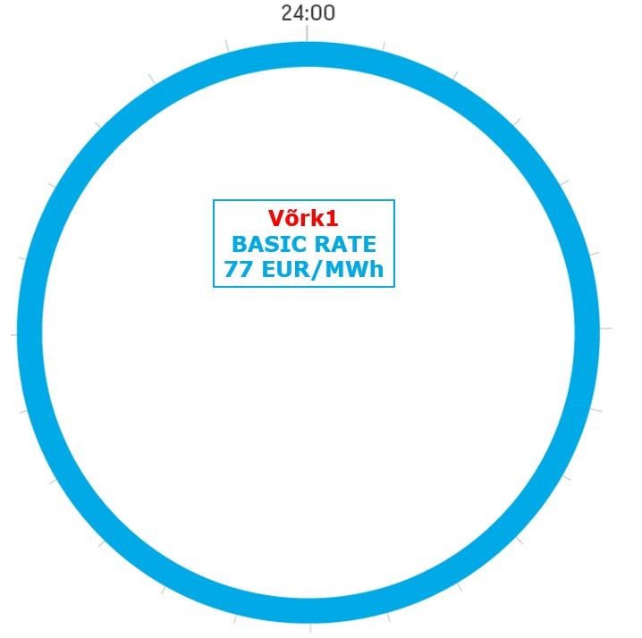 |
|``VORK2``|Elektrilevi  Day 60 EUR/MWh   Night 35 EUR/MWh|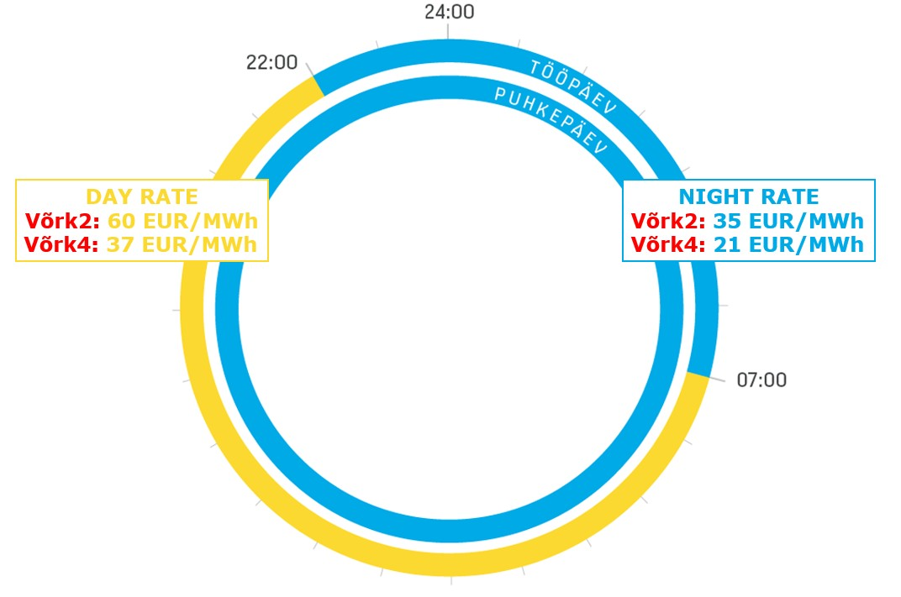|
|``VORK4``|Elektrilevi  Day 37 EUR/MWh   Night 21 EUR/MWh||
|``VORK5``|Elektrilevi  Day 53 EUR/MWh   Night 30 EUR/MWh   Day Peak time 82 EUR/MWh   Holiday Peak Time 47 EUR/MWh|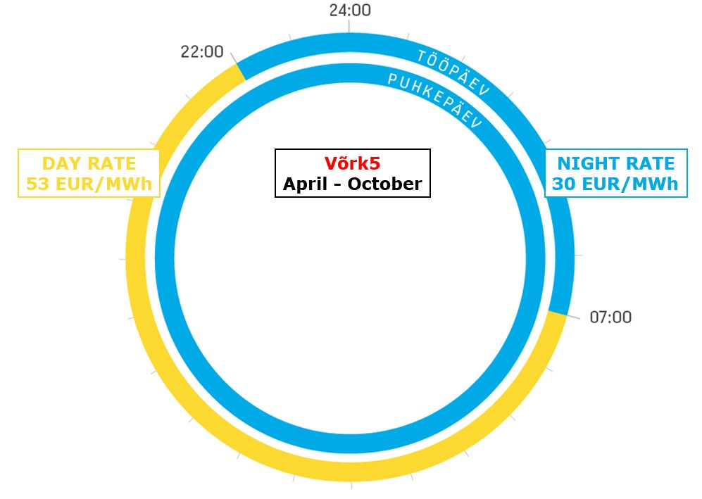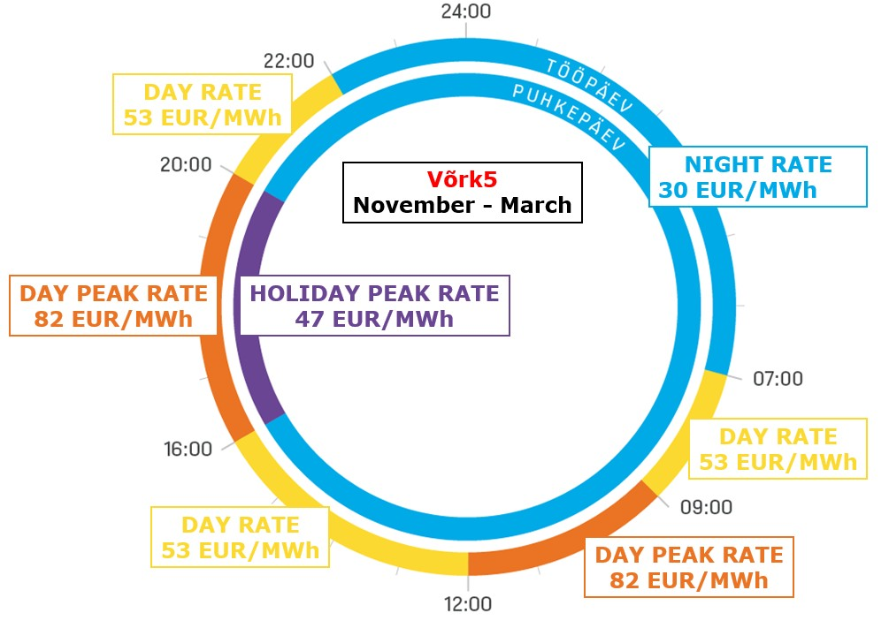|
|``Partner24``|Imatra  Day and night basic rate 60 EUR/MWh|  |
|``Partner24Plus``|Imatra  Day and night basic rate 39 EUR/MWh|  |
|``Partner12``|Imatra  Day 72 EUR/MWh   Night 42 EUR/MWh| Summer Daytime: MO-FR at 8:00–24:00. Summer Night time: MO-FR at 0:00–08:00, SA-SU all day   Winter Daytime: MO-FR at 7:00–23:00. Winter Night time: MO-FR at 23:00–7:00, SA-SU all day |
|``Partner12Plus``|Imatra  Day 46 EUR/MWh   Night 27 EUR/MWh|Summer Daytime: MO-FR at 8:00–24:00. Summer Night time: MO-FR at 0:00–08:00, SA-SU all day   Winter Daytime: MO-FR at 7:00–23:00. Winter Night time: MO-FR at 23:00–7:00, SA-SU all day|
|``NONE``|Network fee is set to 0 and it will not taken into account.||

6. ``heatingCurve: 0`` - Forecast impact increases or decreases the number of hours calculated by the algorithm based on the weather forecast. Default ``0``, shifting by 1 equals 1h. This setting is applicable only if weather forecast used.
Check heating curve impact for [heating time dependency graphs](https://github.com/LeivoSepp/Smart-heating-management-with-Shelly?tab=readme-ov-file#heating-curve).
    * ``-6`` - less heating
    * ``6`` - more heating

1. ``heatingMode: { "timePeriod": 12, "heatingTime": 0,"isFcstUsed": true }`` 

Heating mode options are described in the following table.

> You can customize or change the heating modes to better suit your personal preferences and specific situations. This flexibility allows you to adjust the system based on your needs, energy considerations, and comfort requirements. 

|Heating mode|Description|Best usage|
|---|---|---|
|``{ "timePeriod": 24, "heatingTime": 10,"isFcstUsed": true }``|The heating time for **24-hour** period depends on the **outside temperature**.|Concrete floor heating system or big water tank capable of retaining thermal energy for a duration of at least 10 to 15 hours.|
|``{ "timePeriod": 12, "heatingTime": 5,"isFcstUsed": true }``|The heating time for each **12-hour** period depends on the **outside temperature**.|Gypsum (kipsivalu) floor heating system or water tank capable of retaining thermal energy for a duration of 5 to 10 hours.
|``{ "timePeriod": 6, "heatingTime": 2,"isFcstUsed": true }``|The heating time for each **6-hour** period depends on the **outside temperature**.|Air source heat pumps, radiators or underfloor heating panels with small water tank capable of retaining energy for a duration of 3 to 6 hours.
|``{ "timePeriod": 24, "heatingTime": 20,"isFcstUsed": false }``|Heating is activated during the **20** most cost-effective hours in a **day**.|Ventilation system.
|``{ "timePeriod": 24, "heatingTime": 12,"isFcstUsed": false }``|Heating is activated during the **12** most cost-effective hours in a **day**.|Big water tank 1000L or more.
|``{ "timePeriod": 12, "heatingTime": 6,"isFcstUsed": false }``|Heating is activated during the **six** most cost-effective hours within every **12-hour** period.|Big water tank 1000L or more with heavy usage.
|``{ "timePeriod": 12, "heatingTime": 2,"isFcstUsed": false }``|Heating is activated during the **two** most cost-effective hours within every **12-hour** period. |A 150L hot water boiler for a little household.
|``{ "timePeriod": 6, "heatingTime": 2,"isFcstUsed": false }``|Heating is activated during the **two** most cost-effective hours within every **6-hour** period.|A 200L hot water boiler for a household with four or more people.
|``{ "timePeriod": 0, "heatingTime": 0,"isFcstUsed": false }``|Heating is only activated during hours when the **price is lower** than the specified ``alwaysOnLowPrice``.|
   
8. ``isOutputInverted: true`` - Configures the relay state to either normal or inverted.
    * ``true`` - Inverted relay state. This is required by many heating systems like Nibe or Thermia.
    * ``false`` - Normal relay state, used for water heaters. 

9. ``powerFactor: 0.5`` - Adjusts the heating curve to be either more gradual (flat) or more aggressive (steep). Default ``0.5``. This setting is applicable only if weather forecast used.
    * ``0`` - flat
    * ``1`` - steep

10.  ``relayID: 0`` - Configures the Shelly relay ID when using a Shelly device with multiple relays. Default ``0``.

## Important To Know

* 
When the script is stopped, all schedules are deleted. Shelly only follows the heating algorithm when the script is running.

* 
Only one script can run at a time on newer Shelly devices using Virtual Components, as they are limited to a maximum of 10 components.

* 
Up to two instances of this script can run concurrently in KVS mode, both employing different algorithm. These instances can either operate with the same switch output using Shelly Plus 1 or use different switch outputs, as supported by devices like Shelly Plus 2PM.

* 
This script creates a special "watchdog" script. This "watchdog" script ensures proper cleanup when the heating script is stopped or deleted.

* 
To mitigate the impact of internet outages, this script uses parameter heating time to turn on heating based on historically cheap hours.

* 
The "enable" button for this script must be activated. This setting ensures that the script starts after a power outage, restart, or firmware update.

* 
This script exclusively handles schedulers generated by its own processes. This script is designed to delete only those schedulers that it has created.

* 
This solution will only have benefits if you have an hourly priced energy contract. If your energy contract features a flat rate, this solution will not contribute to reducing your energy bill.

* This script depends on the internet and these two services:
    * Electricity market price from [Elering API](https://dashboard.elering.ee/assets/api-doc.html#/nps-controller/getPriceUsingGET),
    * Weather forecast from [Open-Meteo API](https://open-meteo.com/en/docs).

 

## Tested Failure Scenarios
1. Shelly is working, but the internet goes down due to a home router crash or internet provider malfunction. Shelly time continues running.
2. After a power outage, the internet is not working, and Shelly has no time.
3. Elering HTTP error occurs, and the Elering server is not reachable.
4. Elering API failure happens, and the service is down.
5. Elering API returns incorrect data, and prices are missing.
6. Weather forecast HTTP error occurs, and the server is unavailable.
7. Weather forecast API service error occurs, and the JSON data is not received.

During any of these failures, Shelly uses the ``Heating Time`` duration to turn on heating based on historically cheap hours.
Historical cheap hours are the following periods: 00:00-08:00, 12:00-15:00, and 20:00-23:00. In error mode, Shelly divides the heating time equally between the first and second halves of the day.

 

# Smart Heating Algorithms

## Weather Forecast Algorithm

> This algorithm calculates the heating time for the next day based on weather forecasts. It is particularly effective for various home heating systems, including those with substantial water tanks capable of retaining thermal energy. This approach optimizes energy usage by aligning heating needs with anticipated weather conditions.

### Advantages of Weather Forecast-Based Heating

* Temperature Responsiveness:

When the outside temperature is a mild +17 degrees Celsius, no heating is necessary. Conversely, as the temperature drops to -5 degrees Celsius, there is a need for some heating, and for extremely cold conditions like -20 degrees Celsius, significant amount of heating is required. 

* Smart Heating Management:

Utilizing weather forecasts allows for smart and adaptive heating management. The system will proactively adjust heating times based on the outside temperature, creating a responsive and dynamic heating schedule.

* Location-Specific Forecast:

To provide accurate weather forecasts, location data is necessary. This enables the system to deliver precise predictions for your home's climate, allowing for a customized and effective heating strategy. 

### Shelly Geolocation

> Ensure that your Shelly device has the correct location information by checking Shelly &rarr; Settings &rarr; Geolocation &rarr; Latitude/Longitude.

Note: Shelly's location is determined based on your internet provider's IP address, which may or may not accurately reflect your home location. Verify and update the latitude and longitude settings as needed.

### Heating Curve

The relationship between temperature and heating time is known as the *heating curve*.

Heating time is influenced by the insulation of your household. For instance, an old and uninsulated house may require 10 hours of heating at -5 degrees, whereas a new A-class house might only need 6 hours.

To account for these differences, the script includes the parameter ``heatingCurve``, allowing users to customize the heating curve based on their specific household characteristics.

* 24 hour period graph represents visually how heating time varies with outside temperature and the ``heatingCurve`` parameter which shifts the heating curve to the left or right, whereas shifting 1 equals 1h. The Shelly device has a maximum limit of 20 schedulers, representing the maximum heating hours the script can manage within a 24-hour period. If more heating hours are needed, the script employs a 12-hour algorithm.

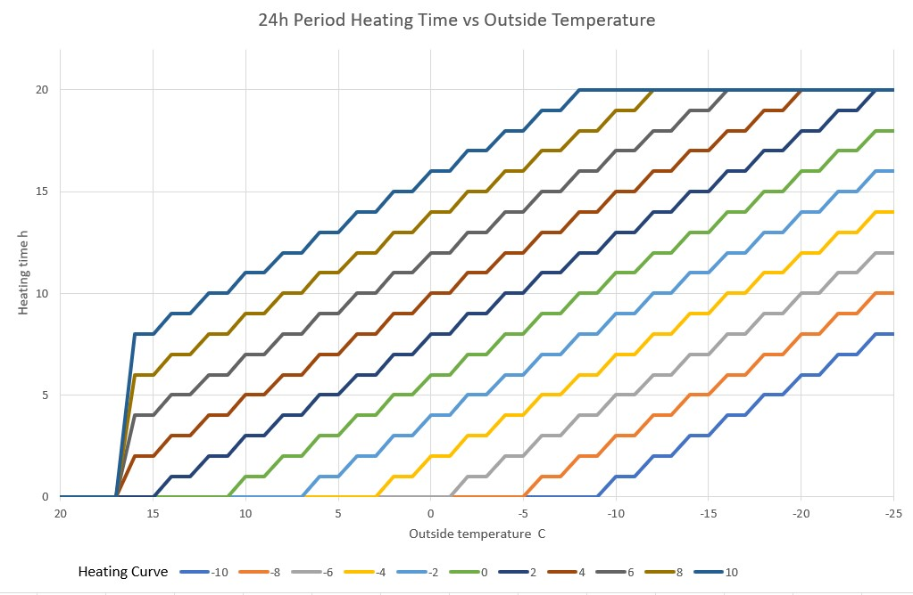

____

* 12 hour period graph represents visually how heating time varies with outside temperature and the ``heatingCurve`` parameter.

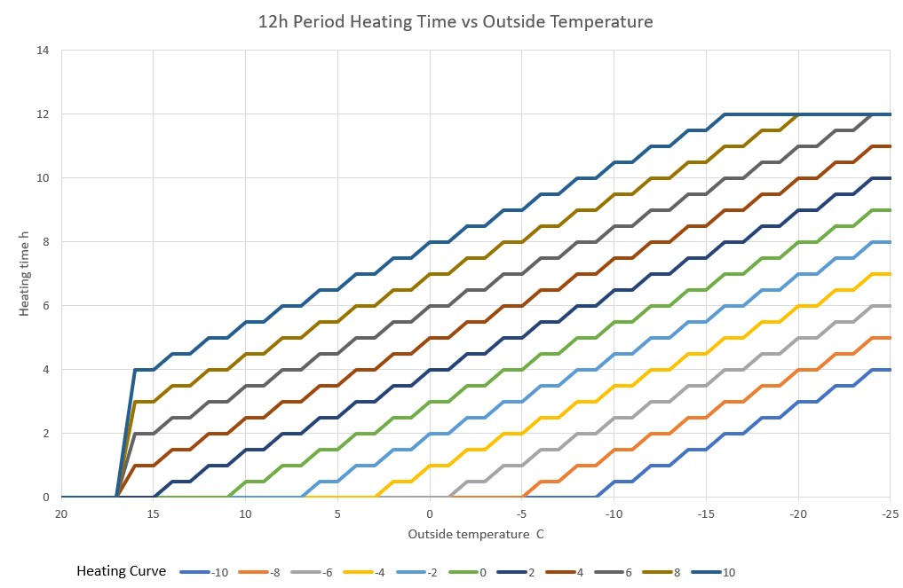

For those interested in the mathematical aspect, the linear equation used to calculate heating time is: ``(Temperature Forecast) * PowerFactor + (Temperature Forecast + heatingCurve)``.

## Time Period Algorithm

> This algorithm divides heating into distinct time periods, activating heating during the most cost-effective hours within each period. It is well-suited for use cases such as hot water boilers, where usage is contingent on the household size rather than external temperature. This method optimizes energy efficiency by aligning heating with periods of lower energy costs.

* A 24-hour graph with 10 heating hours visually shows when the most affordable times for heating are chosen during the day. The red bar represents heating hours within the day.

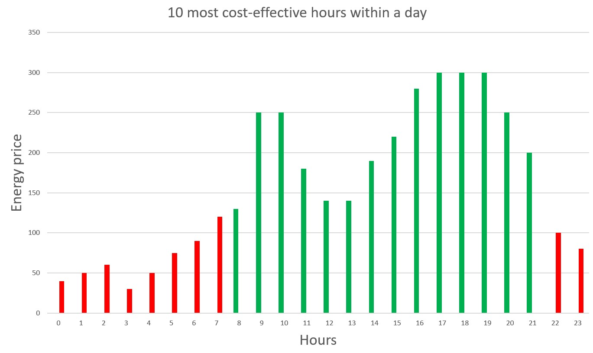

___

* A 4-hour graph with 1 heating hours visually shows how the most affordable time for heating is chosen during each of the 4h-period. The red bar represents heating hour within the period.

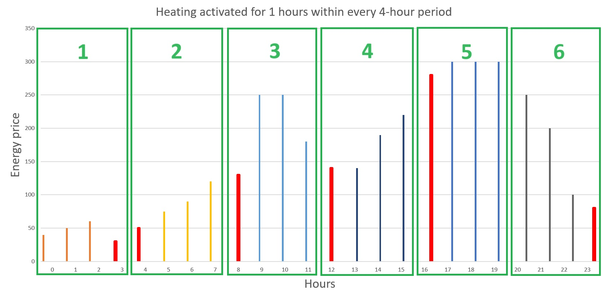

 

# Does it Truly Reduce My Electric Bills
In short: yes.

Here's a more detailed explanation. While your overall daily electric consumption remains the same, this script optimizes the activation of your heating devices for the most economical hours. Consequently, even with the same energy consumption, your electricity bill is reduced.

Appliances like water heaters, water tanks, ground-source or air-source heat pumps, electric radiators, underfloor electric heaters, and air conditioning are examples of energy-intensive devices that benefit from being activated during the most cost-effective times of the day.

Electricity prices can fluctuate significantly, sometimes varying up to 100 times during a day. Check electricity market prices for more information. https://dashboard.elering.ee/et/nps/price

# How to Install this Script

## Installation

1. Optain a Shelly Plus, Pro or Gen3 device [Shelly devices](https://www.shelly.com/collections/smart-monitoring-saving-energy).
2. Connect the Shelly device to your personal WiFi network. Refer to the [Shelly web interface guides.](https://kb.shelly.cloud/knowledge-base/web-interface-guides)
3. The firmware of Shelly Gen2 Plus devices must be version 1.0.0 or higher. The script is not compatible with firmware versions 0.14.* or older.
4. The firmware of Shelly Gen2 Pro or Gen3 devices must be version 1.4.4 or higher. The script will not install Virtual Components if the firmware version is 1.4.3 or older.
5. Open the Shelly device web page: Click Settings &rarr; Device Information &rarr; Device IP &rarr; click on the IP address. The Shelly device web page will open, on the left menu click "<> Scripts".
6. Click the "Library" button (do not click "Create Script") &rarr; Configure URL &rarr; copy-paste and save the following link. By following this method, you can ensure that you will get the latest version of the script.  `https://raw.githubusercontent.com/LeivoSepp/Smart-heating-management-with-Shelly/master/manifest.json`
7. Click "Import code". 

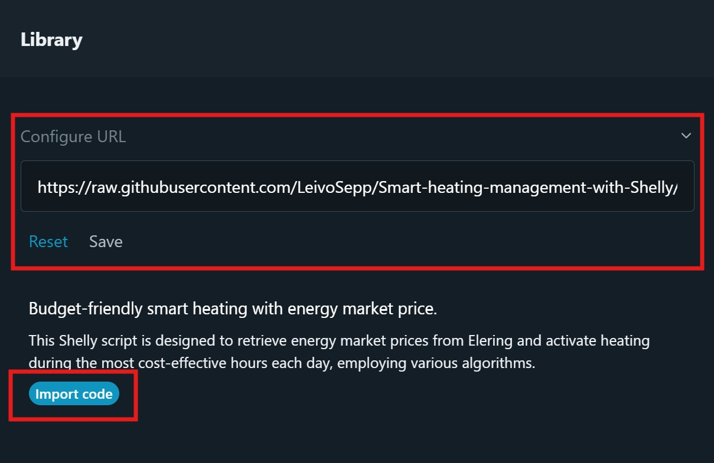

8. Name the script, for instance, "Heating 24h-Forecast", and save. 
9. Click "Start" once the saving process is complete.
10. Configuring Script parameters
    - [Using Shelly App](#using-shelly-app)
    - [Using Shelly KVS](#using-shelly-kvs)

## Updating Script

1. Open script web page in [Github](https://github.com/LeivoSepp/Smart-heating-management-with-Shelly/blob/v3.2/SmartHeatingWidthShelly.js).
2. Click the button "Copy raw file". Now the script is in your clipboard memory.
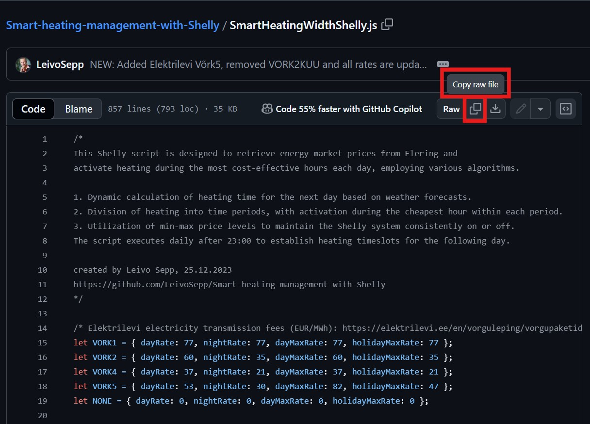

3. Access the Shelly device web page: Navigate to Settings → Device Information &rarr; Device IP &rarr; click on the IP address. The Shelly device web page will open; on the left menu, select "<> Scripts."
4. Open the script you wish to update.
5. Select all script code and delete it **Ctrl+A** &rarr; **Delete**. 
6. Paste the code from the clipboard to the script window **Ctrl+V**.
7. Save the script, the version is now updated. 
8. All configurations remain unchanged, as they are stored in KVS or Virtual Components.

## How to Verify Script Execution

1. In Shelly app or web page, navigate to "Schedules".
2. Inspect the scheduled times when the Shelly will be activated.
3. Schedulers are organized based on the time.
4. Advanced users can inspect KVS storage: [Advanced → Key Value Storage → Script Data](#advanced--key-value-storage--script-data)

## How the Script Operates

1. Internet Connection: 
    * The script needs the internet to download daily electricity prices and weather forecasts.
2. Daily Operation:
    * It runs every day after 23:00 or as needed during the day to set up heating times.
3. Workflow:
    * The script follows a flowchart to determine the best heating hours based on market prices and weather forecasts.

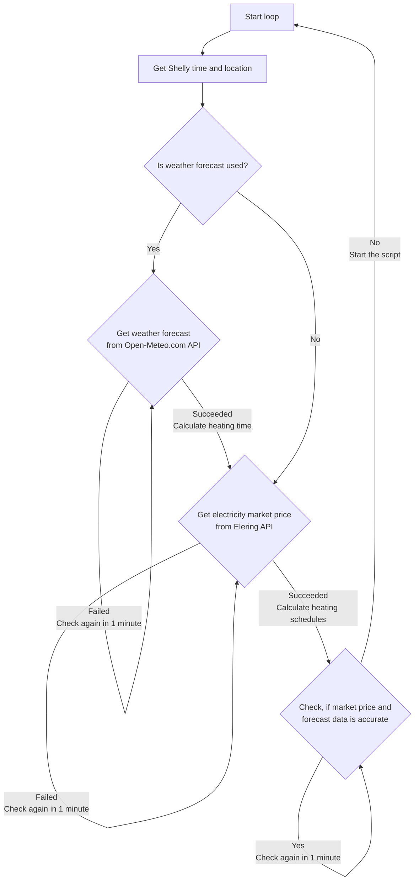
```mermaid
flowchart TD
    0[Start loop] --> A
    A[Get Shelly time and location] --> K{Is weather forecast used?}
    K -- Yes --> B{Get weather forecast <br> from Open-Meteo.com API}
    B -- Succeeded </br>Calculate heating time --> D{Get electricity market price <br> from Elering API}
    K -- No --> D
    B -- Failed</br>Check again in 1 minute --> B
    D -- Succeeded</br>Calculate heating schedules --> L{Check, if market price and </br> forecast data is accurate}
    D -- Failed</br>Check again in 1 minute --> D
    L -- Yes</br>Check again in 1 minute --> L
    L -- No</br>Start the script --> 0
```

4. Watchdog workflow

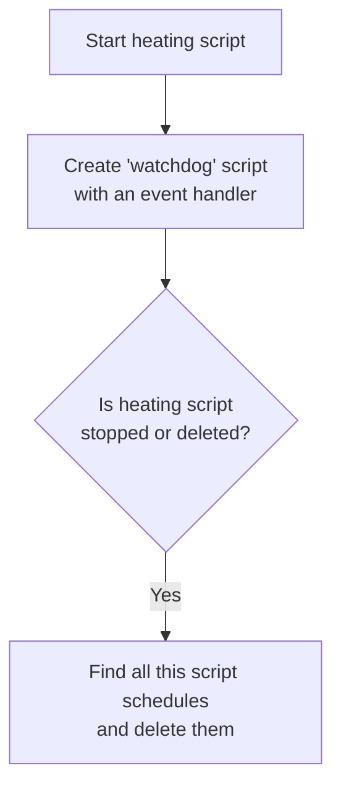
```mermaid
flowchart TD
    0[Start heating script] --> A
    A[Create 'watchdog' script </br>with an event handler] --> K{Is heating script </br>stopped or deleted?}
    K -- Yes --> B[Find all this script schedules</br>and delete them]
```

# Troubleshooting

## Message "This schedule contains invalid call method or params"

Currently, in Shelly device web page, all schedules are labeled with the message "This schedule contains an invalid call method or params," and attempting to click on any schedule fails to open them.

This as a Shelly bug. It's important to note two key points regarding this issue:

1. All schedules are accessible and viewable without any problems through the Shelly cloud or mobile app. Therefore, there is no cause for concern about the integrity of the schedules or their functionality.
2. A temporary solution has been identified for accessing schedules through the device web page. By clicking on the schedule and then refreshing the page, users can successfully open the schedule.

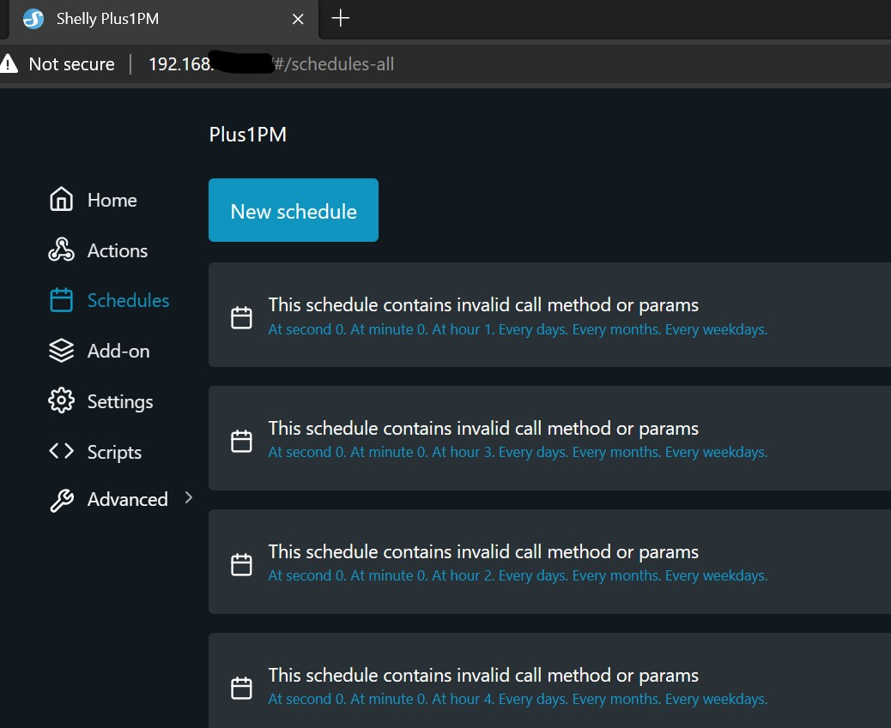

## Message "Id3: #1 Scheduler at: 12:00 price: 185.91 EUR/MWh (energy price + transmission). FAILED, 20 schedulers is the Shelly limit."

The attempt to add a scheduler has failed due to the Shelly-imposed limit of 20 schedulers. This limit is applicable to the entire device, irrespective of the Shelly model, including multichannel devices such as the Pro4PM. 

> To address this limitation, we recommend utilizing the heating mode HEAT12H_FCST. This mode calculates schedules every twelve hours, enabling you to create up to 12 schedules within each twelve-hour cycle. This alternative mode ensures flexibility in scheduling while adhering to the device's limitations.

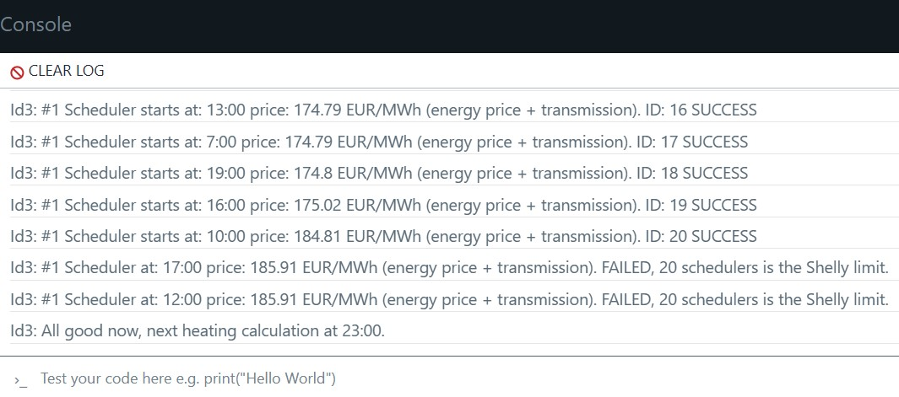

## Error "Couldn't get script"

There is an issue within the Shelly system that may affect your experience when attempting to open scripts through the Shelly cloud or mobile app. The encountered error, "Couldn't get script," is a known bug preventing the opening of scripts larger than 15kB via these platforms.

To navigate around this inconvenience, we suggest the following workarounds:

1. Open the Script Through Device Web Page:
Access the device web page to successfully open any script. This method provides a direct and reliable solution to view and manage your scripts seamlessly.

2. Alternative Solution Through Shelly Cloud:
If accessing the device web page is not feasible, follow these steps on the Shelly cloud:

   1. Delete the existing script.
   2. Create a new script.
   3. Copy and paste the entire script into the scripting window.
   4. Configure all necessary settings.
   5. Save and close the script.
   6. Run the script.

    If any issues arise during this process, you can repeat the workaround by starting from the script deletion step.

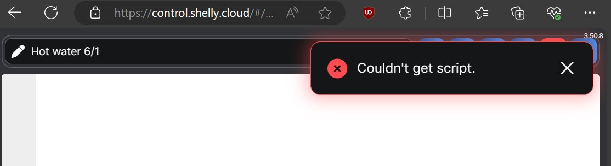

## Advanced &rarr; Key Value Storage &rarr; Script Data

The script saves data in Shelly KVS (Key-Value-Storage) to preserve it in case of power outages or restarts.

To access the stored data on the Shelly device web page, navigate to **Advanced &rarr; KVS**.

1. Key: ``schedulerIDs1`` Value: ``[1,2,3,4,5,6,7]``
   
    The numeric values represent schedule ID numbers created by the script. This information is crucial for each script to identify and manage schedules associated with it. It aids in the proper deletion of outdated schedules when creating new ones is necessary.

2. Key: ``lastcalculation1`` Value: ``Fri Dec 27 2024 23:29:20 GMT+0200`` 
   
   This timestamp indicates the time when the script successfully retrieved market prices from Elering and created schedules. While this information is primarily for your reference, it offers insights into the timeline of script activities.

3. Key: ``version1`` Value: ``3.8`` 
   
   The version indicates the installed script version.

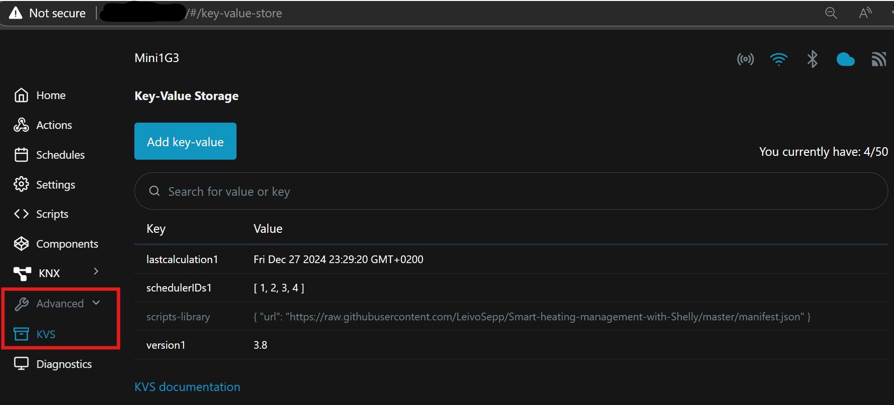
