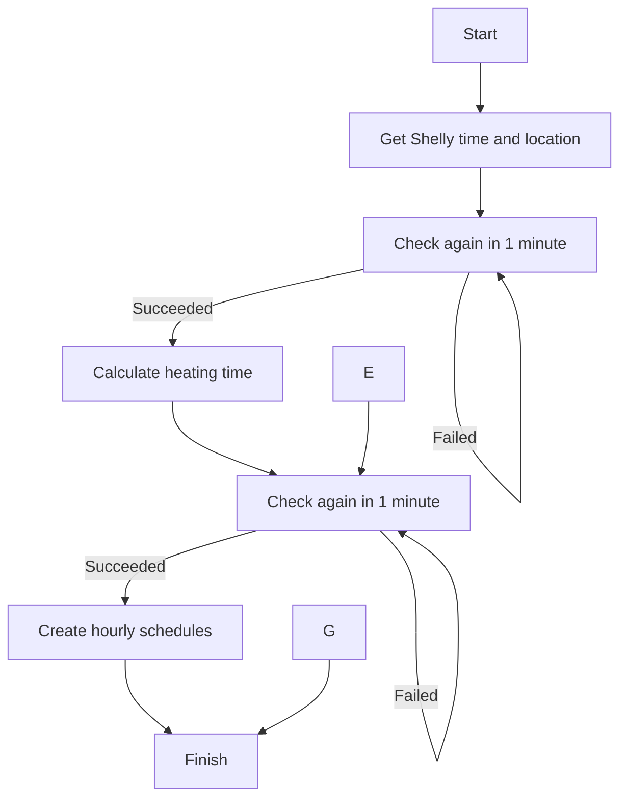

# Smart and cheap heating with Shelly

## What is this script?
This Shelly script is designed to retrieve energy market prices from Elering and
activate heating during the most cost-effective hours each day, employing various algorithms. 

1. Dynamic calculation of heating time for the next day based on weather forecasts.
2. Division of heating into time periods, with activation during the cheapest hour within each period.
3. Utilization of min-max price levels to maintain the Shelly system consistently on or off.

The script runs daily after 23:00 or as necessary during the day to set up heating time slots for the upcoming period.    

## Configuration parameters

* ``heatingMode: HEAT24H_FCST`` - Heating mode, options are described in the following table.

> You can customize or change the heating modes to better suit your personal preferences and specific situations. This flexibility allows you to adjust the system based on your needs, energy considerations, and comfort requirements.

|Heating mode|Description|Best usage|
|---|---|---|
|``HEAT24H_FCST``|The heating time for **24-hour** period depends on the **outside temperature**.|Concrete floor heating system or big water tank capable of retaining thermal energy for a duration of at least 10 to 15 hours.|
|``HEAT12H_FCST``|The heating time for each **12-hour** period depends on the **outside temperature**.|Gypsum (kipsivalu) floor heating system or water tank capable of retaining thermal energy for a duration of 5 to 10 hours.
|``HEAT6H_FCST``|The heating time for each **6-hour** period depends on the **outside temperature**.|Air source heat pumps, radiators or underfloor heating panels with small water tank capable of retaining energy for a duration of 3 to 6 hours.
|``HEAT24H_12H``|Heating is activated during the **12** most cost-effective hours in a **day**.|Big water tank 1000L or more.
|``HEAT24H_8H``|Heating is activated during the **8** most cost-effective hours in a **day**.|Big water tank 1000L or more.
|``HEAT12H_6H``|Heating is activated during the **six** most cost-effective hours within every **12-hour** period.|Big water tank 1000L or more with heavy usage.
|``HEAT12H_2H``|Heating is activated during the **two** most cost-effective hours within every **12-hour** period. |A 50L hot water boiler for a single person.
|``HEAT6H_2H``|Heating is activated during the **two** most cost-effective hours within every **6-hour** period.|A 200L hot water boiler for a household with four or more people.
|``HEAT6H_1H``|Heating is activated during the **single** most cost-effective hours within every **6-hour** period. |A 100L hot water boiler for a small household with two people.
|``HEAT4H_2H``|Heating is activated during the **two** most cost-effective hours within every **4-hour** period.|A 200L hot water boiler for a household with six or more people with heavy usage.
|``HEAT4H_1H``|Heating is activated during the **single** most cost-effective hours within every **4-hour** period.|A 100L hot water boiler for a household with four or more people.
|``HEATMINMAX``|Heating is only activated during hours when the **price is lower** than the specified **alwaysOnMaxPrice**.|
   
* ``elektrilevi: VORK2KUU`` - Elektrilevi transmission fee, options are the following.

|Heating mode|Description|
|---|---|
|``VORK1``|Elektrilevi Võrk1. Day and night rate is 72 EUR/MWh|
|``VORK2``|Elektrilevi Võrk2. Day 87 and night 50 EUR/MWh|
|``VORK2KUU``|Elektrilevi Võrk2 with monthly fee. Day 56 and night 33 EUR/MWh|
|``VORK4``|Elektrilevi Võrk4. Day 37 and night 21 EUR/MWh|
|``NONE``|Transmission fee is set to 0.|

* ``alwaysOnMaxPrice: 10`` - Keep heating always ON if energy price lower than this value (EUR/MWh).

* ``alwaysOffMinPrice: 300`` - Keep heating always OFF if energy price higher than this value (EUR/MWh).

* ``isOutputInverted: false`` - Configures the relay state to either normal or inverted.
    * ``true`` - Inverted relay state. This is required by many heating systems like Nibe or Thermia.
    * ``false`` - Normal relay state. 

* ``relayID: 0`` - Configures the Shelly relay ID when employing a Shelly device with multiple relays. Default ``0``.

* ``defaultTimer: 60`` - Configures the default timer duration, in minutes, for toggling the Shelly state. The default value is set to ``60`` to align with hourly changes in energy prices.

* ``country: "ee"`` - Specifies the country for energy prices: 
    * ``ee`` - Estonia
    * ``fi`` - Finland
    * ``lt`` - Lithuania
    * ``lv`` - Latvia

* ``heatingCurve: 0`` - Adjusts the heating curve by shifting it to the left or right. Default ``0``, shifting by 1 equals 1h. This setting is applicable only if weather forecast used.
    * ``-10`` - less heating
    * ``10`` - more heating

* ``powerFactor: 0.5`` - Adjusts the heating curve to be either more gradual (flat) or more aggressive (steep). Default ``0.5``. This setting is applicable only if weather forecast used.
    * ``0`` - flat
    * ``1`` - steep

## Important to know

* 
To mitigate the impact of power or internet outages, this script operates continuously. It checks every minute to confirm whether updates are needed for energy market prices or the current weather forecast.

* 
The "enable" button for this script must be activated. This setting ensures that the script starts after a power outage, restart, or firmware update.

* 
The Shelly firmware must be version 1.0.0 or higher. The script is not compatible with the firmware 0.14.* or older.

* 
Up to three instances (limited by Shelly) of this script can run concurrently, each employing different algorithms. These instances can either operate with the same switch output using Shelly Plus 1 or use different switch outputs, as supported by devices like Shelly PRO 4PM.

* 
This script exclusively handles schedulers generated by its own processes. In contrast to the previous version, which featured a "delete all schedulers" command, this script is designed to delete only those schedulers that it has created.

* 
This script works in Shelly Plus, Shelly Pro and Shelly Gen3 devices.

* 
When saving the script, avoid immediately clicking "Start" to prevent potential issues with Shelly that may occur if you initiate the start process too quickly. Initiate Start once the saving process, which may take 3-6 seconds, is complete.

* 
This solution will only yield benefits if you have an hourly priced energy contract. If your energy contract features a flat rate, this solution will not contribute to reducing your energy bill.

* This script depends on the internet and these two services:
    * Electricity market price from [Elering API](https://dashboard.elering.ee/assets/api-doc.html#/nps-controller/getPriceUsingGET),
    * Weather forecast from [Open-Meteo API](https://open-meteo.com/en/docs).

 

# Smart heating algorithms

## Weather Forecast Algorithm

> This algorithm calculates the heating time for the next day based on weather forecasts. It is particularly effective for various home heating systems, including those with substantial water tanks capable of retaining thermal energy. This approach optimizes energy usage by aligning heating needs with anticipated weather conditions.

### Advantages of Weather Forecast-Based Heating

* Temperature Responsiveness:

When the outside temperature is a mild +17 degrees Celsius, no heating is necessary. Conversely, as the temperature drops to -5 degrees Celsius, there is a need for some heating, and for extremely cold conditions like -20 degrees Celsius, significant amount of heating is required. 

* Smart Heating Management:

Utilizing weather forecasts allows for smart and adaptive heating management. The system will proactively adjust heating times based on the outside temperature, creating a responsive and dynamic heating schedule.

* Location-Specific Forecast:

To provide accurate weather forecasts, location data is necessary. This enables the system to deliver precise predictions for your home's climate, allowing for a customized and effective heating strategy. 

### Shelly Geolocation

> Ensure that your Shelly device has the correct location information by checking Shelly &rarr; Settings &rarr; Geolocation &rarr; Latitude/Longitude.

Note: Shelly's location is determined based on your internet provider's IP address, which may or may not accurately reflect your home location. Verify and update the latitude and longitude settings as needed.

### Heating curve

The relationship between temperature and heating time is known as the *heating curve*.

Heating time is influenced by the insulation of your household. For instance, an old and uninsulated house may require 10 hours of heating at -5 degrees, whereas a new A-class house might only need 6 hours.

To account for these differences, the script includes the parameter ``heatingCurve``, allowing users to customize the heating curve based on their specific household characteristics.

* 24 hour period graph represents visually how heating time varies with outside temperature and the ``heatingCurve`` parameter which shifts the heating curve to the left or right, whereas shifting 1 equals 1h.  

____

* 12 hour period graph represents visually how heating time varies with outside temperature and the ``heatingCurve`` parameter.

For those interested in the mathematical aspect, the linear equation used to calculate heating time is: ``(Temperature Forecast) * PowerFactor + (Temperature Forecast + heatingCurve)``.

## Time Period Algorithm

> This algorithm divides heating into distinct time periods, activating heating during the most cost-effective hours within each period. It is well-suited for use cases such as hot water boilers, where usage is contingent on the household size rather than external temperature. This method optimizes energy efficiency by aligning heating with periods of lower energy costs.

* A 24-hour graph with 10 heating hours visually shows when the most affordable times for heating are chosen during the day. The red bar represents heating hours within the day.

___

* A 4-hour graph with 1 heating hours visually shows how the most affordable time for heating is chosen during each of the 4h-period. The red bar represents heating hour within the period.

 

# How to install this script?

1. Optain a Shelly Plus, Pro or Gen3 device [Shelly devices](https://www.shelly.cloud/en-ee/products/).
2. Connect the Shelly device to your personal WiFi network. Refer to the [Shelly web interface guides.](https://kb.shelly.cloud/knowledge-base/web-interface-guides)
3. Open the Shelly device web page: Click Settings &rarr; Device Information &rarr; Device IP &rarr; click on the IP address. The Shelly device web page will open, on the left menu click "<> Scripts".
4. Click the "Library" button (do not click "Add Script") &rarr; Configure URL &rarr; copy-paste and save the following link. By following this method, you can ensure that you always have the latest version of the script.  `https://raw.githubusercontent.com/LeivoSepp/Smart-heating-management-with-Shelly/master/manifest.json`
5. Configure Parameters:
    - Set heating mode based on your requirements.
    - Set the Elektrilevi transmission fee contract.
    - Set the output relay mode: normal or inverted. 
    - Set the price when the heating is always on.
    - Set the highest price when the heating will never turn on.
6. Name the script, for instance, "Heating 24h-Forecast," and save. However, avoid immediately clicking "Start" to prevent potential issues with Shelly that may occur if you initiate the start process too quickly.
7. Initiate Start once the saving process is complete.

## How to Verify Script Execution

1. In Shelly app or web page, navigate to "Schedules".
2. Inspect the scheduled times when the Shelly will be activated.
3. Schedulers are organized based on the market price.

# Does it Truly Reduce My Electric Bills?
In short: yes.

Here's a more detailed explanation. While your overall daily electric consumption remains the same, this script optimizes the activation of your heating devices for the most economical hours. Consequently, even with the same energy consumption, your electricity bill is reduced.

Appliances like water heaters, water tanks, ground-source or air-source heat pumps, electric radiators, underfloor electric heaters, and air conditioning are examples of energy-intensive devices that benefit from being activated during the most cost-effective times of the day.

Electricity prices can fluctuate significantly, sometimes varying up to 100 times during a day. Check electricity market prices for more information. https://dashboard.elering.ee/et/nps/price

## How this script works?

1. This script requires internet connection to download daily basis electricity market prices and weather forecast.
2. After first run, the script creates a schedule for itself and runs daily basis between 23:00-23:15.
3. The script follows this flowchart.

