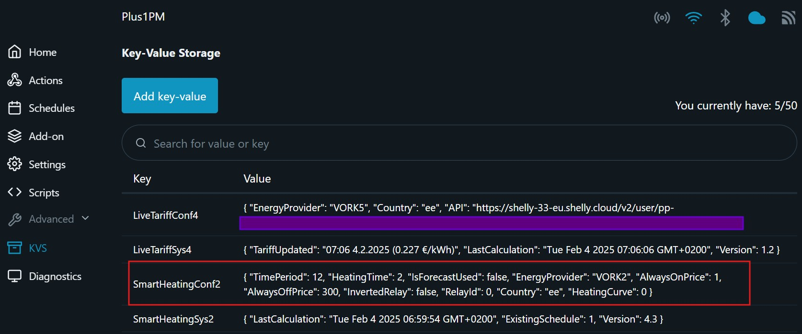
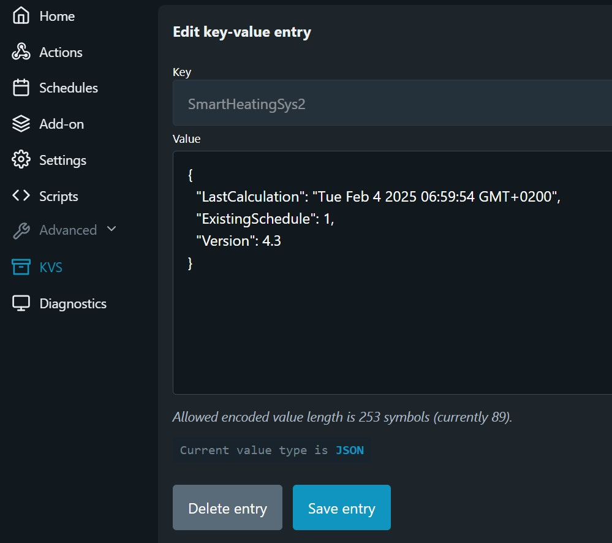

# Smart and cheap heating with Shelly

> [!TIP]
> This Shelly script is designed to optimize heating activation by leveraging energy market prices from Elering, ensuring heating operates during the most cost-effective hours using various algorithms.

- [Smart and cheap heating with Shelly](#smart-and-cheap-heating-with-shelly)
  - [Key Features](#key-features)
  - [Monitoring and edit schedule](#monitoring-and-edit-schedule)
  - [How to check the Heating Schedule](#how-to-check-the-heating-schedule)
  - [Configuring Script parameters](#configuring-script-parameters)
    - [Configuration using Virtual Components](#configuration-using-virtual-components)
    - [How to force script to KVS mode](#how-to-force-script-to-kvs-mode)
    - [Configuration using KVS](#configuration-using-kvs)
      - [Heating parameters](#heating-parameters)
      - [``"EnergyProvider": "VORK1"``](#energyprovider-vork1)
      - [``"AlwaysOnPrice": 10``](#alwaysonprice-10)
      - [``"AlwaysOffPrice": 300``](#alwaysoffprice-300)
      - [``"InvertedRelay": false``](#invertedrelay-false)
      - [``"RelayId": 0``](#relayid-0)
      - [``"Country": "ee"``](#country-ee)
      - [``"HeatingCurve": 0``](#heatingcurve-0)
- [How to Install this Script](#how-to-install-this-script)
  - [Installation](#installation)
  - [How to run two instances of this script](#how-to-run-two-instances-of-this-script)
    - [How to force script to KVS mode](#how-to-force-script-to-kvs-mode-1)
  - [Updating Script](#updating-script)
  - [How to Verify Script Execution](#how-to-verify-script-execution)
  - [How the Script Operates](#how-the-script-operates)
  - [Important To Know](#important-to-know)
  - [Tested Failure Scenarios](#tested-failure-scenarios)
- [Smart Heating Algorithms](#smart-heating-algorithms)
  - [Weather Forecast Algorithm](#weather-forecast-algorithm)
    - [Advantages of Weather Forecast-Based Heating](#advantages-of-weather-forecast-based-heating)
    - [Shelly Geolocation](#shelly-geolocation)
    - [Heating Curve](#heating-curve)
  - [Time Period Algorithm](#time-period-algorithm)
- [Does it Truly Reduce My Electric Bills](#does-it-truly-reduce-my-electric-bills)
- [Troubleshooting](#troubleshooting)
  - [Error "Couldn't get script"](#error-couldnt-get-script)
  - [Advanced → Key Value Storage → Script Data](#advanced--key-value-storage--script-data)
- [License](#license)
- [Author](#author)

## Key Features
1. **Dynamic Heating Time Calculation**:
Calculates optimal heating times for the next day based on weather forecasts and energy prices.

1. **Time Period Division**:
Divides the day into time periods and activates heating during the cheapest hour within each period.

1. **Price-Level Utilization**:
Employs minimum and maximum price thresholds to keep the Shelly system consistently on or off based on cost efficiency.

1. **Two script instances can run on same Shelly device**:
Starting from the version 4.2, two script instances are supported on same Shelly device. The script memory usage was reduced from 16kB to 4.3kB and peak memory reduced from 25kB to 12kB.

**Execution Schedule**:
The script runs daily after 23:00 or as necessary during the day to set up heating time slots for the upcoming period.    

## Monitoring and edit schedule

> [!NOTE]
> Starting from the script version 3.9 (January 2025), this script creates a single scheduler using an advanced timespec that includes all the required heating hours.

## How to check the Heating Schedule
To view the heating hours created by the script:
1. Open the schedule.
2. Click on Time to see the full heating schedule.

|||
|-|-|
|||


> [!TIP] How to edit schedule manually
You can manually override the schedule by clicking on any hour to include or exclude it for a specific day, then lick Next &rarr; Next &rarr; Save.  
> The next time the script calculates a new schedule, it will generate a fresh schedule with the updated timespec.

**How to monitor script execution**  
The field ``LastCalculation`` in KVS is updated each time electricity prices are retrieved from Elering and a heating schedule is generated for the next heating period.  
The field ``ExistingSchedule`` in KVS is the scheduleID created by this script.

## Configuring Script parameters

### Configuration using Virtual Components 
> [!TIP]
> This script supports Shelly Virtual Components, allowing script parameters to be modified remotely using the Shelly app on a mobile phone.

Virtual Components are supported on Shelly Gen 2 Pro devices, as well as all newer Gen 3 and later devices.


### How to force script to KVS mode

> [!TIP]
> This script can be forced to KVS mode even if Virtal Components are available.  

You want to have this in KVS mode in case you have other important scripts already using Virtual Components in the same device.  
Open the script and set the ManualKVS parameter ``mnKv: true``. Now the script will install in KVS mode.

```js
let c = {
    tPer: 24,       // KVS:TimePeriod VC:Heating Period (h) 24/12/6/0
    hTim: 10,       // KVS:HeatingTime VC:Heating Time (h/period)
    isFc: false,    // KVS:IsForecastUsed VC:Forecast Heat
    pack: "VORK2",  // KVS:EnergyProvider VC:Network Package (NONE, VORK1, VORK2, VORK4, VORK5, PARTN24, PARTN24PL, PARTN12, PARTN12PL)
    lowR: 1,        // KVS:AlwaysOnPrice VC:Heat On (min price) (EUR/MWh)
    higR: 300,      // KVS:AlwaysOffPrice VC:Heat Off (max price) (EUR/MWh)
    Inv: false,     // KVS:InvertedRelay VC:Inverted Relay
    rId: 0,         // KVS:RelayId VC: N/A, always first relay (0)
    cnty: "ee",     // KVS:Country VC:Market Price Country (ee, fi, lv, lt)
    hCur: 0,        // KVS:HeatingCurve VC:Heating Curve 
    tmr: 60,        // Default timer
    pFac: 0.5,      // Power factor
    mnKv: false,    // Forcing script to KVS mode (true) or Virtual components mode (false)
}
```

### Configuration using KVS 
If the script in **KVS mode**, then settings can be modified via the device's web page using its IP address: Menu → Advanced → KVS.  
All the user settings are stored in JSON format under the key ``SmartHeatingConf``.

> [!IMPORTANT]
> Starting from the version 4.2, script configuration settings are stored in JSON format in KVS.  
> This helps to reduce script memory usage and enables to run two script instances in the same Shelly device.




#### Heating parameters

```
"TimePeriod": 24,
"HeatingTime": 10,
"IsForecastUsed": true,
``` 
These options are described in the following table.

> You can customize or change the heating modes to better suit your personal preferences and specific situations. This flexibility allows you to adjust the system based on your needs, energy considerations, and comfort requirements. 

|Heating mode|Description|Proposed usage|
|---|---|---|
|``"TimePeriod": 24,``<br>``"HeatingTime": 10,`` <br>``"IsForecastUsed": true``|The heating time for **24-hour** period depends on the **outside temperature**.|Concrete floor heating system or big water tank capable of retaining thermal energy for a duration of at least 10 to 15 hours.|
|``"TimePeriod": 12,``<br>``"HeatingTime": 5,``<br>``"IsForecastUsed": true``|The heating time for each **12-hour** period depends on the **outside temperature**.|Gypsum (kipsivalu) floor heating system or water tank capable of retaining thermal energy for a duration of 5 to 10 hours.|
|``"TimePeriod": 6,``<br>``"HeatingTime": 2,``<br>``"IsForecastUsed": true``|The heating time for each **6-hour** period depends on the **outside temperature**.|Air source heat pumps, radiators or underfloor heating panels with small water tank capable of retaining energy for a duration of 3 to 6 hours.|
|``"TimePeriod": 24,``<br>``"HeatingTime": 20,``<br>``"IsForecastUsed": false``|Heating is activated during the **20** most cost-effective hours in a **day**.|Ventilation system.
|``"TimePeriod": 24,``<br>``"HeatingTime": 12,``<br>``"IsForecastUsed": false``|Heating is activated during the **12** most cost-effective hours in a **day**.|Big water tank 1000L or more.
|``"TimePeriod": 12,``<br>``"HeatingTime": 6,``<br>``"IsForecastUsed": false``|Heating is activated during the **six** most cost-effective hours within every **12-hour** period.|Big water tank 1000L or more with heavy usage.
|``"TimePeriod": 12,``<br>``"HeatingTime": 2,``<br>``"IsForecastUsed": false``|Heating is activated during the **two** most cost-effective hours within every **12-hour** period. |A 150L hot water boiler for a little household.
|``"TimePeriod": 6,``<br>``"HeatingTime": 2,``<br>``"IsForecastUsed": false``|Heating is activated during the **two** most cost-effective hours within every **6-hour** period.|A 200L hot water boiler for a household with four or more people.
|``"TimePeriod": 0,``<br>``"HeatingTime": 0,``<br>``"IsForecastUsed": false``|Heating is only activated during hours when the **price is lower** than the specified ``alwaysOnLowPrice``.|

#### ``"EnergyProvider": "VORK1"``
Defines the Elektrilevi or Imatra electricity transmission tariff package. Options include VORK1, VORK2, VORK4, VORK5, Partner24, Partner24Plus, Partner12, Partner12Plus, and NONE. Select None to ignore transmission fees. 
Please check the details in this [Elektrilevi page](https://elektrilevi.ee/en/vorguleping/vorgupaketid/eramu) or [Imatra page](https://imatraelekter.ee/vorguteenus/vorguteenuse-hinnakirjad/). Options are the following.

|Network package|Description||
|---|---|-|
|``VORK1``|Elektrilevi<br> Day and night basic rate 77 EUR/MWh|  |
|``VORK2``|Elektrilevi<br> Day 60 EUR/MWh <br> Night 35 EUR/MWh||
|``VORK4``|Elektrilevi<br> Day 37 EUR/MWh <br> Night 21 EUR/MWh||
|``VORK5``|Elektrilevi<br> Day 53 EUR/MWh <br> Night 30 EUR/MWh <br> Day Peak time 82 EUR/MWh <br> Holiday Peak Time 47 EUR/MWh||
|``PARTN24``|Imatra<br> Day and night basic rate 60 EUR/MWh|  |
|``PARTN24PL``|Imatra<br> Day and night basic rate 39 EUR/MWh|  |
|``PARTN12``|Imatra<br> Day 72 EUR/MWh <br> Night 42 EUR/MWh| Summer Daytime: MO-FR at 8:00–24:00.<br>Summer Night time: MO-FR at 0:00–08:00, SA-SU all day <br> Winter Daytime: MO-FR at 7:00–23:00.<br>Winter Night time: MO-FR at 23:00–7:00, SA-SU all day |
|``PARTN12PL``|Imatra<br> Day 46 EUR/MWh <br> Night 27 EUR/MWh|Summer Daytime: MO-FR at 8:00–24:00.<br>Summer Night time: MO-FR at 0:00–08:00, SA-SU all day <br> Winter Daytime: MO-FR at 7:00–23:00.<br>Winter Night time: MO-FR at 23:00–7:00, SA-SU all day|
|``NONE``|Network fee is set to 0 and it will not taken into account.||

#### ``"AlwaysOnPrice": 10``
Keep heating always on if the electricity market price lower than this value (EUR/MWh).

#### ``"AlwaysOffPrice": 300``
Keep heating always OFF if electricity market price higher than this value (EUR/MWh).

#### ``"InvertedRelay": false``
Configures the relay state to either normal or inverted.
* ``true`` - Inverted relay state. This is required by many heating systems like Nibe or Thermia.
* ``false`` - Normal relay state, used for water heaters. 

#### ``"RelayId": 0``
Configures the Shelly relay ID when using a Shelly device with multiple relays. Default ``0``.

#### ``"Country": "ee"``
Specifies the country for energy prices. Only countries available in the Elering API are supported. 
* ``ee`` - Estonia
* ``fi`` - Finland
* ``lt`` - Lithuania
* ``lv`` - Latvia

#### ``"HeatingCurve": 0``
Forecast impact increases or decreases the number of hours calculated by the algorithm based on the weather forecast. Default ``0``, shifting by 1 equals 1h. This setting is applicable only if weather forecast used.
Check heating curve impact for [heating time dependency graphs](https://github.com/LeivoSepp/Smart-heating-management-with-Shelly?tab=readme-ov-file#heating-curve).
    * ``-6`` - less heating
    * ``6`` - more heating

# How to Install this Script

## Installation

1. Optain a Shelly Plus, Pro or Gen3 device [Shelly devices](https://www.shelly.com/collections/smart-monitoring-saving-energy).
2. Connect the Shelly device to your personal WiFi network. Refer to the [Shelly web interface guides.](https://kb.shelly.cloud/knowledge-base/web-interface-guides)

5. Open the Shelly device web page: Click Settings &rarr; Device Information &rarr; Device IP &rarr; click on the IP address. The Shelly device web page will open, on the left menu click "<> Scripts".
6. Click the "Create Script".
7. Open script from the [Github](https://github.com/LeivoSepp/Smart-heating-management-with-Shelly/blob/v3.2/SmartHeatingWidthShelly.js).
8. Click the button "Copy raw file". Now the script content is in your clipboard memory.  


6. Paste the code from the clipboard to the script window **Ctrl+V**.
1. Name the script, for instance, "Heating 24h-Forecast", and save. 
2. Click "Start" once the saving process is complete.
3.  Configure Script parameters
    - [Using Shelly App Virtual Components](#using-shelly-app)
    - [Using Shelly KVS](#using-shelly-kvs)

## How to run two instances of this script

If Virtual Components are supported, then the first instance in installed using Virtual Components. All the configuration is done through the Virtual Components.  
The second instance of this script can run only in KVS-mode in the same device.

### How to force script to KVS mode

> [!TIP]
> This script can be forced to KVS mode even if Virtal Components are available.  

You want to have this in KVS mode in case you have other important scripts already using Virtual Components in the same device.  
Open the script and set the ManualKVS parameter ``mnKv: true``. Now the script will install in KVS mode.

```js
let c = {
    tPer: 24,       // KVS:TimePeriod VC:Heating Period (h) 24/12/6/0
    hTim: 10,       // KVS:HeatingTime VC:Heating Time (h/period)
    isFc: false,    // KVS:IsForecastUsed VC:Forecast Heat
    pack: "VORK2",  // KVS:EnergyProvider VC:Network Package (NONE, VORK1, VORK2, VORK4, VORK5, PARTN24, PARTN24PL, PARTN12, PARTN12PL)
    lowR: 1,        // KVS:AlwaysOnPrice VC:Heat On (min price) (EUR/MWh)
    higR: 300,      // KVS:AlwaysOffPrice VC:Heat Off (max price) (EUR/MWh)
    Inv: false,     // KVS:InvertedRelay VC:Inverted Relay
    rId: 0,         // KVS:RelayId VC: N/A, always first relay (0)
    cnty: "ee",     // KVS:Country VC:Market Price Country (ee, fi, lv, lt)
    hCur: 0,        // KVS:HeatingCurve VC:Heating Curve 
    tmr: 60,        // Default timer
    pFac: 0.5,      // Power factor
    mnKv: false,    // Forcing script to KVS mode (true) or Virtual components mode (false)
}
```

## Updating Script

> [!WARNING] 
> Direct upgrade from script version 4.1 to a newer version is not supported due to a change in KVS data format to JSON.
> After installation, you must reconfigure all settings either in KVS or via Virtual Components.

1. Open script from the [Github](https://github.com/LeivoSepp/Smart-heating-management-with-Shelly/blob/v3.2/SmartHeatingWidthShelly.js).
2. Click the button "Copy raw file". Now the script is in your clipboard memory.


3. Access the Shelly device web page: Navigate to Settings → Device Information &rarr; Device IP &rarr; click on the IP address. The Shelly device web page will open; on the left menu, select "<> Scripts."
4. Open the script you wish to update.
5. Select all script code and delete it **Ctrl+A** &rarr; **Delete**. 
6. Paste the code from the clipboard to the script window **Ctrl+V**.
7. Save the script, the version is now updated. 
8. All configurations remain unchanged, as they are stored in KVS or Virtual Components.

## How to Verify Script Execution

1. In Shelly app or web page, navigate to "Schedules".
2. Inspect the scheduled times when the Shelly will be activated.
3. Schedulers are organized based on the time.
4. Advanced users can inspect KVS storage: [Advanced → Key Value Storage → Script Data](#advanced--key-value-storage--script-data)

## How the Script Operates

1. Internet Connection: 
    * The script needs the internet to download daily electricity prices and weather forecasts.
2. Daily Operation:
    * It runs every day after 23:00 or as needed during the day to set up heating times.
3. Workflow:
    * The script follows a flowchart to determine the best heating hours based on market prices and weather forecasts.


4. Watchdog workflow


## Important To Know

* <p>When the script is stopped, the schedule is deleted. Shelly only follows the heating algorithm when the script is running.</p>
* <p>Two script instances can run in parallel, however, if the first is in Virtual Components mode, then the second instance can run only in KVS-mode on the same device.</p>
* <p>Up to two instances of this script can run concurrently in KVS mode, both employing different algorithm. These instances can either operate with the same switch output using Shelly Plus 1 or use different switch outputs, as supported by devices like Shelly Plus 2PM.</p>
* <p>This script creates a special "watchdog" script. This "watchdog" script ensures proper cleanup when the heating script is stopped or deleted.</p>
* <p>To mitigate the impact of internet outages, this script uses parameter ``heating time`` to turn on heating based on historically cheap hours.</p>
* <p>The "Run on startup" button for this script must be activated. This setting ensures that the script starts after a power outage, restart, or firmware update.</p>
* <p>This script exclusively handles scheduler generated by its own processes. This script is designed to delete only the scheduler that it has created.</p>
* <p>This solution will only have benefits if you have an hourly priced energy contract. If your energy contract features a flat rate, this solution will not contribute to reducing your energy bill.</p>
* This script depends on the internet and these two services:
    * Electricity market price from [Elering API](https://dashboard.elering.ee/assets/api-doc.html#/nps-controller/getPriceUsingGET),
    * Weather forecast from [Open-Meteo API](https://open-meteo.com/en/docs).
* <p>The firmware of Shelly Gen2 Plus devices must be version 1.4.4 or higher. The KVS store is read only if the firmware version is 1.4.3 or older.
* <p>The firmware of Shelly Gen2 Pro or Gen3 devices must be version 1.4.4 or higher. The script will not install Virtual Components if the firmware version is 1.4.3 or older.
<br>

## Tested Failure Scenarios
During any of the failures below, Shelly uses the ``Heating Time`` duration to turn on heating based on historically cheap hours.

In error mode, Shelly divides the heating time bsaed on the configured periods.

**Failure scenarios:**
1. Shelly is working, but the internet goes down due to a home router crash or internet provider malfunction. Shelly time continues running.
2. After a power outage, the internet is not working, and Shelly has no time.
3. Elering HTTP error occurs, and the Elering server is not reachable.
4. Elering API failure happens, and the service is down.
5. Elering API returns incorrect data, and prices are missing.
6. Weather forecast HTTP error occurs, and the server is unavailable.
7. Weather forecast API service error occurs, and the JSON data is not received.

# Smart Heating Algorithms

## Weather Forecast Algorithm

> [!TIP]Weather Forecast
> This algorithm calculates the heating time for the next day based on weather forecasts. It is particularly effective for various home heating systems, including those with substantial water tanks capable of retaining thermal energy. This approach optimizes energy usage by aligning heating needs with anticipated weather conditions.

### Advantages of Weather Forecast-Based Heating

* Temperature Responsiveness:

When the outside temperature is a mild +17 degrees Celsius, no heating is necessary. Conversely, as the temperature drops to -5 degrees Celsius, there is a need for some heating, and for extremely cold conditions like -20 degrees Celsius, significant amount of heating is required. 

* Smart Heating Management:

Utilizing weather forecasts allows for smart and adaptive heating management. The system will proactively adjust heating times based on the outside temperature, creating a responsive and dynamic heating schedule.

* Location-Specific Forecast:

To provide accurate weather forecasts, location data is necessary. This enables the system to deliver precise predictions for your home's climate, allowing for a customized and effective heating strategy. 

### Shelly Geolocation

> [!IMPORTANT]
> Ensure that your Shelly device has the correct location information by checking Shelly &rarr; Settings &rarr; Geolocation &rarr; Latitude/Longitude.

Note: Shelly's location is determined based on your internet provider's IP address, which may or may not accurately reflect your home location. Verify and update the latitude and longitude settings as needed.

### Heating Curve

The relationship between temperature and heating time is known as the *heating curve*.

Heating time is influenced by the insulation of your household. For instance, an old and uninsulated house may require 10 hours of heating at -5 degrees, whereas a new A-class house might only need 6 hours.

To account for these differences, the script includes the parameter ``heatingCurve``, allowing users to customize the heating curve based on their specific household characteristics.

* 24 hour period graph represents visually how heating time varies with outside temperature and the ``heatingCurve`` parameter which shifts the heating curve to the left or right, whereas shifting 1 equals 1h. The Shelly device has a maximum limit of 20 schedulers, representing the maximum heating hours the script can manage within a 24-hour period. If more heating hours are needed, the script employs a 12-hour algorithm.


____

* 12 hour period graph represents visually how heating time varies with outside temperature and the ``heatingCurve`` parameter.


For those interested in the mathematical aspect, the linear equation used to calculate heating time is: ``(Temperature Forecast) * PowerFactor + (Temperature Forecast + heatingCurve)``.

## Time Period Algorithm

> This algorithm divides heating into distinct time periods, activating heating during the most cost-effective hours within each period. It is well-suited for use cases such as hot water boilers, where usage is contingent on the household size rather than external temperature. This method optimizes energy efficiency by aligning heating with periods of lower energy costs.

* A 24-hour graph with 10 heating hours visually shows when the most affordable times for heating are chosen during the day. The red bar represents heating hours within the day.


___

* A 4-hour graph with 1 heating hours visually shows how the most affordable time for heating is chosen during each of the 4h-period. The red bar represents heating hour within the period.


</br>

# Does it Truly Reduce My Electric Bills
In short: yes.

Here's a more detailed explanation. While your overall daily electric consumption remains the same, this script optimizes the activation of your heating devices for the most economical hours. Consequently, even with the same energy consumption, your electricity bill is reduced.

Appliances like water heaters, water tanks, ground-source or air-source heat pumps, electric radiators, underfloor electric heaters, and air conditioning are examples of energy-intensive devices that benefit from being activated during the most cost-effective times of the day.

Electricity prices can fluctuate significantly, sometimes varying up to 100 times during a day. Check electricity market prices for more information. https://dashboard.elering.ee/et/nps/price

# Troubleshooting

## Error "Couldn't get script"

There is an issue within the Shelly system that may affect your experience when attempting to open scripts through the Shelly cloud or mobile app. The encountered error, "Couldn't get script," is a known bug preventing the opening of scripts larger than 15kB via these platforms.

To navigate around this inconvenience, we suggest the following workarounds:

1. Open the Script Through Device Web Page:
Access the device web page to successfully open any script. This method provides a direct and reliable solution to view and manage your scripts seamlessly.

2. Alternative Solution Through Shelly Cloud:
If accessing the device web page is not feasible, follow these steps on the Shelly cloud:

   1. Delete the existing script.
   2. Create a new script.
   3. Copy and paste the entire script into the scripting window.
   4. Configure all necessary settings.
   5. Save and close the script.
   6. Run the script.

    If any issues arise during this process, you can repeat the workaround by starting from the script deletion step.


## Advanced &rarr; Key Value Storage &rarr; Script Data

The script saves data in Shelly KVS (Key-Value-Storage) to preserve it in case of power outages or restarts.

To access the stored data on the Shelly device web page, navigate to **Advanced &rarr; KVS**.

2. Key: ``LastCalculation`` Value: ``Fri Dec 27 2024 23:29:20 GMT+0200`` 
   
   This timestamp indicates the time when the script successfully retrieved market prices from Elering and created schedules. While this information is primarily for your reference, it offers insights into the timeline of script activities.

1. Key: ``ExistingSchedule`` Value: ``1``
   
    The numeric values represent schedule ID number created by the script. This information is crucial for each script to identify and manage schedule associated with it. It aids in the proper deletion of outdated schedules when creating new ones is necessary.

3. Key: ``Version`` Value: ``4.3`` 
   
   The version indicates the installed script version.



# License

This project is licensed under the MIT License. See the [LICENSE](LICENSE) file for details.

# Author

Created by Leivo Sepp, 2024-2025

[Smart heating management with Shelly - GitHub Repository](https://github.com/LeivoSepp/Smart-heating-management-with-Shelly)