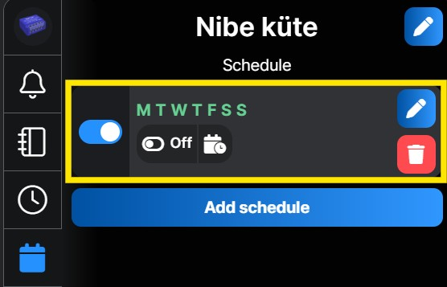
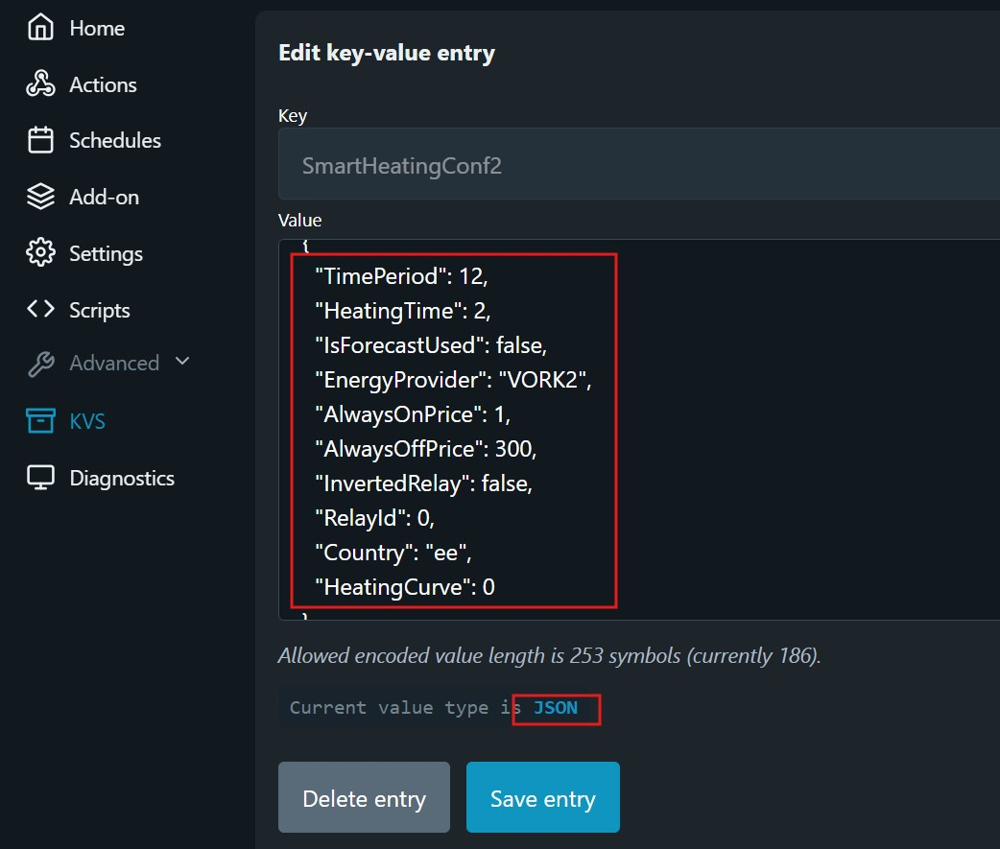
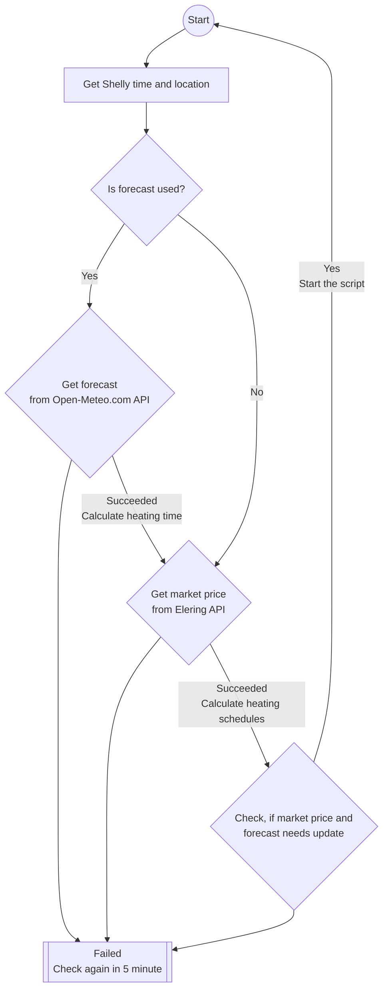
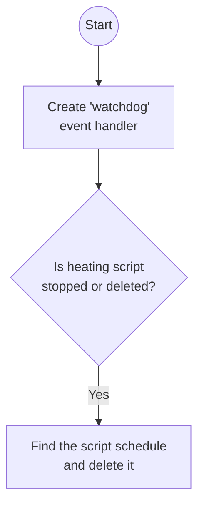
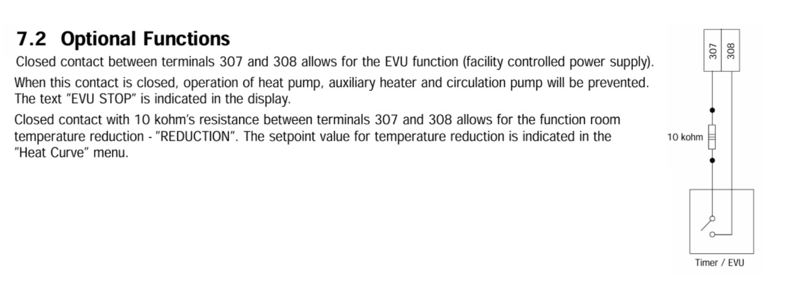
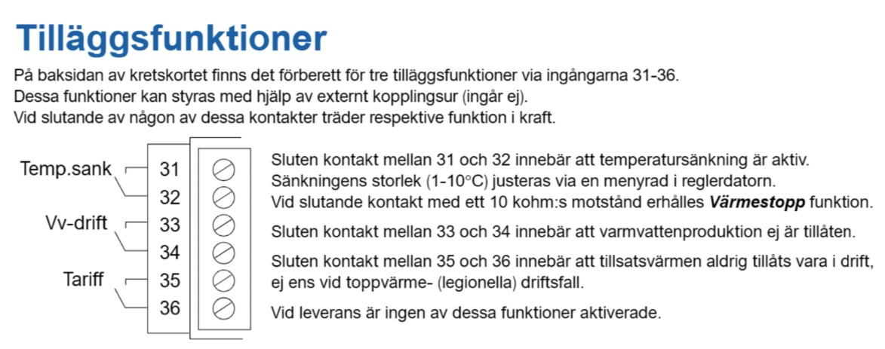
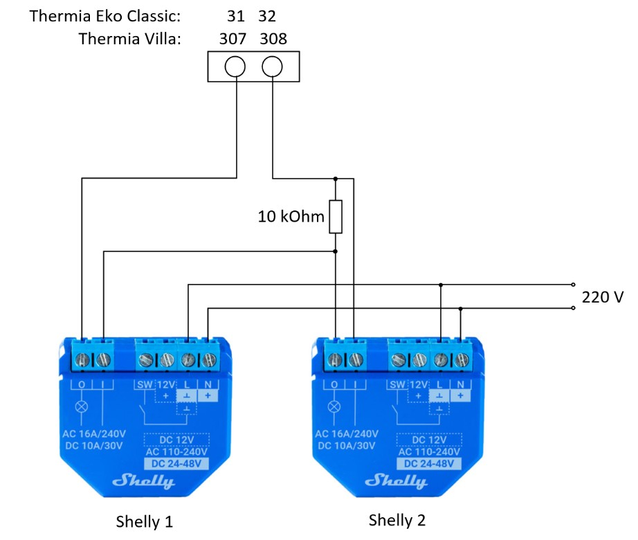
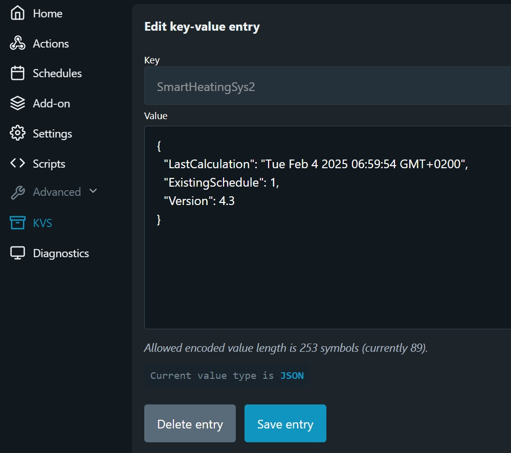

# Nutikas ja odav börsihinna järgi kütmine Shellyga 

> [!TIP]
> See Shelly skript tagab kütteseadme töö kõige odavamate tundide ajal, kasutades elektri börsihindu ja erinevaid algoritme.

- [Nutikas ja odav börsihinna järgi kütmine Shellyga](#nutikas-ja-odav-börsihinna-järgi-kütmine-shellyga)
  - [Põhifunktsioonid](#põhifunktsioonid)
  - [Jälgimine ja ajakava muutmine](#jälgimine-ja-ajakava-muutmine)
  - [Kuidas kontrollida ajakava](#kuidas-kontrollida-ajakava)
  - [Skripti parameetrite konfigureerimine](#skripti-parameetrite-konfigureerimine)
    - [Skripti Virtual Componentide häälestamine](#skripti-virtual-componentide-häälestamine)
    - [Kuidas panna skript tööle KVS-modes](#kuidas-panna-skript-tööle-kvs-modes)
    - [Skripti KVS häälestamine](#skripti-kvs-häälestamine)
      - [Heating parameters](#heating-parameters)
      - [``"EnergyProvider": "VORK1"``](#energyprovider-vork1)
      - [``"AlwaysOnPrice": 10``](#alwaysonprice-10)
      - [``"AlwaysOffPrice": 300``](#alwaysoffprice-300)
      - [``"InvertedRelay": false``](#invertedrelay-false)
      - [``"RelayId": 0``](#relayid-0)
      - [``"Country": "ee"``](#country-ee)
      - [``"HeatingCurve": 0``](#heatingcurve-0)
- [Kuidas seda skripti installida](#kuidas-seda-skripti-installida)
  - [Paigaldamine](#paigaldamine)
  - [Kuidas panna tööle kaks installatsiooni](#kuidas-panna-tööle-kaks-installatsiooni)
    - [Kuidas panna skript tööle KVS-modes](#kuidas-panna-skript-tööle-kvs-modes-1)
  - [Skripti uuendamine](#skripti-uuendamine)
  - [Kuidas kontrollida et skript töötab](#kuidas-kontrollida-et-skript-töötab)
  - [Kuidas skript töötab](#kuidas-skript-töötab)
  - [Oluline teada](#oluline-teada)
  - [Testitud rikkestsenaariumid](#testitud-rikkestsenaariumid)
- [Maasoojuspumpade Thermia Villa \& Eko Classic nutikas kütmine Shelly abil](#maasoojuspumpade-thermia-villa--eko-classic-nutikas-kütmine-shelly-abil)
- [Nutikad kütte algoritmid](#nutikad-kütte-algoritmid)
  - [Ilmaprognoosi algoritm](#ilmaprognoosi-algoritm)
    - [Ilmaprognoosipõhise kütmise eelised](#ilmaprognoosipõhise-kütmise-eelised)
    - [Shelly geograafiline asukoht](#shelly-geograafiline-asukoht)
    - [Küttegraafik](#küttegraafik)
  - [Ajaperioodi algoritm](#ajaperioodi-algoritm)
- [Kas see tõesti vähendab minu elektriarveid](#kas-see-tõesti-vähendab-minu-elektriarveid)
- [Tõrkeotsing](#tõrkeotsing)
  - [Viga "Couldn't get script"](#viga-couldnt-get-script)
  - [Advanced → Key Value Storage → Script Data](#advanced--key-value-storage--script-data)
- [Litsents](#litsents)
- [Autor](#autor)


## Põhifunktsioonid 
1. **Ilmaennustusega odavad tunnid**: Järgmise päeva küttetunnid on optimeeritud ilmaprognoosi ja energiahindade põhjal. 
2. **Fikseeritud odavad tunnid**: Jaota päev ajaperioodideks (6, 12 või 24) ja aktiveeri küte iga perioodi kõige odavama(te)l tundidel. 
3. **Hinnatasemete kasutamine**: Kasuta min ja max hinnaläve, et hoida Shelly süsteem sellest lähtuvalt ka sees või väljas. 

**Käivituse ajakava**: Skript töötab iga päev pärast 23:00 või vajadusel päeva jooksul, et arvutada järgmise perioodi või päeva küttetunnid. 

## Jälgimine ja ajakava muutmine 

> [!NOTE]
> Alates skriptiversioonist 3.9 (jaanuar 2025) loob see skript ühe ajakava, mis sisaldab kõiki vajalikke küttetunde. 

## Kuidas kontrollida ajakava 
Skripti loodud küttetundide vaatamiseks: 
1. Avage Shelly ajakava (Schedule). 
2. Klõpsake **Time**, et näha täielikku kütteseadme ajakava. 

|||
|-|-| 
||| 

> [!TIP] 
> Saate ajakava käsitsi muuta, klõpsates mis tahes tunnil, et see lisada või eemaldada, seejärel klõpsake Next &rarr; Next &rarr; Save.  
> Järgmine kord kui skript arvutab uue ajakava, kirjutatakse kõik käsitsi loodudmuudatused üle. 

**Kuidas jälgida skripti käivitumist**   
Andmeväli ``LastCalculation`` KVS-is värskendatakse iga kord, kui Eleringist on saadud uued elektrihinnad ja genereeritakse järgmise perioodi ajakava.  
Andmeväli ``ExistingSchedule`` KVS-s on antud skripti poolt loodud schedule ID.

## Skripti parameetrite konfigureerimine 

### Skripti Virtual Componentide häälestamine
> [!TIP]
> See skript kasutab **Virtuaalseid Komponente**, mis võimaldab kõiki seadeid hallata otse Shelly Cloud veebilehelt või mobiilirakendusest.  

Virtuaalseid komponente toetatakse Shelly Gen 2 Pro seadmetes ja kõigis Gen 3 ja uuemates seadmetes. 

 

### Kuidas panna skript tööle KVS-modes

> [!TIP]
> See skript võib käia ka KVS-modes isegi kui Virtuaalsed Komponendid on saadaval.

Seda häälestust on vaja juhul, kui antud Shelly seadme peal on juba mõni teine skript mis kasutab Virtuaalseid Komponente.
Ava skript ja pane ManualKVS parameeter ``mnKv: true``. Peale seda installeerub skript KVS-modes.

```js
let c = {
    tPer: 24,       // KVS:TimePeriod VC:Heating Period (h) 24/12/6/0
    hTim: 10,       // KVS:HeatingTime VC:Heating Time (h/period)
    isFc: false,    // KVS:IsForecastUsed VC:Forecast Heat
    pack: "VORK2",  // KVS:EnergyProvider VC:Network Package (NONE, VORK1, VORK2, VORK4, VORK5, PARTN24, PARTN24PL, PARTN12, PARTN12PL)
    lowR: 1,        // KVS:AlwaysOnPrice VC:Heat On (min price) (EUR/MWh)
    higR: 300,      // KVS:AlwaysOffPrice VC:Heat Off (max price) (EUR/MWh)
    Inv: false,     // KVS:InvertedRelay VC:Inverted Relay
    rId: 0,         // KVS:RelayId VC: N/A, always first relay (0)
    cnty: "ee",     // KVS:Country VC:Market Price Country (ee, fi, lv, lt)
    hCur: 0,        // KVS:HeatingCurve VC:Heating Curve 
    tmr: 60,        // Default timer
    pFac: 0.5,      // Power factor
    mnKv: false,    // Forcing script to KVS mode (true) or Virtual components mode (false)
}
```

### Skripti KVS häälestamine

Kui skript on **KVS-modes**, saab seadeid muuta seadme veebilehe kaudu, kasutades selle IP-aadressi: Menu → Advanced → KVS.  
Kõik kasutaja häälestused asuvad JSON formaadis parameetri ``SmartHeatingConf`` all.

> [!IMPORTANT]
> Alates versioonist 4.2, hoitakse KVS-s andmeid JSON formaadis.  
> See aitab kaasa paremale mäluhaldusele, muuda Shelly töö stabiilsemaks ning võimaldab mitu samaaegset installatsiooni.




#### Heating parameters

```
"TimePeriod": 24,
"HeatingTime": 10,
"IsForecastUsed": true,
``` 
Vaata küttereziimide osas alltoodud tabelit.

> Küttereziime saate kohandada viisil, et need sobiksid teie isiklike eelistuste ja konkreetsete olukordadega.

| Kütte režiim | Kirjeldus | Parim kasutus |
| --- | --- | --- |
| ``TimePeriod": 24,``<br>``"HeatingTime": 10,`` <br>``"IsForecastUsed": true`` | Kütmise aeg **24-tunnise** perioodi kohta sõltub **välistemperatuurist**. | Betoonpõranda kütmine või suur veepaak, mis suudab hoida soojusenergiat vähemalt 10–15 tundi. |
| ``TimePeriod": 12,``<br>``"HeatingTime": 5,``<br>``"IsForecastUsed": true`` | Kütmise aeg iga **12-tunnise** perioodi kohta sõltub **välistemperatuurist**. | Kipsivalu põrandaküte või veepaak, mis suudab hoida soojusenergiat 5–10 tundi. |
| ``TimePeriod": 6,``<br>``"HeatingTime": 2,``<br>``"IsForecastUsed": true`` | Kütmise aeg iga **6-tunnise** perioodi kohta sõltub **välistemperatuurist**. | Õhk-soojuspumbad, radiaatorid või põrandaküttesüsteemid väikese veepaagiga, mis suudab hoida energiat 3–6 tundi. |
| ``TimePeriod": 24,``<br>``"HeatingTime": 20,``<br>``"IsForecastUsed": false`` | Küte on aktiveeritud **20** kõige odavamal tunnil päevas. | Näiteks ventilatsioonisüsteem. |
| ``TimePeriod": 24,``<br>``"HeatingTime": 12,``<br>``"IsForecastUsed": false`` | Küte on aktiveeritud **12** kõige odavamal tunnil päevas. | Suur veepaak 1000L või rohkem. |
| ``TimePeriod": 12,``<br>``"HeatingTime": 6,``<br>``"IsForecastUsed": false`` | Küte on aktiveeritud **kuuel** kõige odavamal tunnil igas **12-tunnises** perioodis. | Suur veepaak 1000L või rohkem, suure kasutusega. |
| ``TimePeriod": 12,``<br>``"HeatingTime": 2,``<br>``"IsForecastUsed": false`` | Küte on aktiveeritud **kahel** kõige odavamal tunnil igas **12-tunnises** perioodis. | Väike 150L veeboiler väikesele majapidamisele. |
| ``TimePeriod": 6,``<br>``"HeatingTime": 2,``<br>``"IsForecastUsed": false`` | Küte on aktiveeritud **kahel** kõige kulutõhusamal tunnil igas **6-tunnises** perioodis. | Suur 200L veeboiler neljale või enamale inimesele mõeldud majapidamisele. |
| ``TimePeriod": 0,``<br>``"HeatingTime": 0,``<br>``"IsForecastUsed": false`` | Küte on aktiveeritud ainult tundidel, kui elektri börsihind on madalam kui määratud ``alwaysOnLowPrice``. |

#### ``"EnergyProvider": "VORK1"``
Elektrilevi või Imatra elektri ülekandetasude pakett. Valikus on VORK1, VORK2, VORK4, VORK5, Partner24, Partner24Plus, Partner12, Partner12Plus ja NONE. Vali None, et mitte arvestada ülekandetasusid. 
Ülekandetasude üksikasjad leiab siit: [Elektrilevi](https://elektrilevi.ee/en/vorguleping/vorgupaketid/eramu) või [Imatra](https://imatraelekter.ee/vorguteenus/vorguteenuse-hinnakirjad/).

| Võrgupakett | Kirjeldus | |
| - | - | :-: |
| ``VORK1`` | **Elektrilevi**<br> Päev/öö 77 EUR/MWh |  |
| ``VORK2`` | **Elektrilevi**<br> Päeval 60 EUR/MWh <br> Öösel 35 EUR/MWh |  |
| ``VORK4`` | **Elektrilevi**<br> Päeval 37 EUR/MWh <br> Öösel 21 EUR/MWh |  |
| ``VORK5`` | **Elektrilevi**<br> Päeval 53 EUR/MWh <br> Öösel 30 EUR/MWh <br> Päeva tipp 82 EUR/MWh <br> Puhke tipp 47 EUR/MWh |   |
| ``PARTN24`` | **Imatra**<br> Päev/öö 60 EUR/MWh | |
| ``PARTN24P`` | **Imatra**<br> Päev/öö 39 EUR/MWh | |
| ``PARTN12`` | **Imatra**<br> Päeval 72 EUR/MWh <br> Öösel 42 EUR/MWh | Suveaeg päev: E-R kell 8:00–24:00.<br>Öö: E-R kell 0:00–08:00, L-P terve päev <br> Talveaeg päev: E-R kell 7:00–23:00.<br>Öö: E-R kell 23:00–7:00, L-P terve päev |
| ``PARTN12P`` | **Imatra**<br> Päeval 46 EUR/MWh <br> Öösel 27 EUR/MWh | Suveaeg päev: E-R kell 8:00–24:00.<br>Öö: E-R kell 0:00–08:00, L-P terve päev <br> Talveaeg päev: E-R kell 7:00–23:00.<br>Öö: E-R kell 23:00–7:00, L-P terve päev |
| ``NONE`` | Võrgutasu on 0 ||

#### ``"AlwaysOnPrice": 10``
Küte on igal juhul sees, kui börsihind on sellest väärtusest madalam (EUR/MWh). 

#### ``"AlwaysOffPrice": 300``
Küte on igal juhul väljas, kui börsihind ületab selle väärtuse (EUR/MWh). 

#### ``"InvertedRelay": false``
Konfigureerib relee oleku kas normaalseks või pööratud.
    * ``true`` - Pööratud relee olek. Seda nõuavad mitmed maasoojuspumbad nagu Nibe või Thermia.
    * ``false`` - Normaalne relee olek, seda kasutatakse veeboilerite või elektrilise põrandakütte puhul. 

#### ``"RelayId": 0``
Shelly relay ID on vaikimisi 0, kuid mitme väljundiga Shelly puhul tähistab see relee ID numbrit.


#### ``"Country": "ee"``
Börsihinna riik. Toetatud on ainult Eleringi API riigid. * ``ee`` - Eesti * ``fi`` - Soome * ``lt`` - Leedu * ``lv`` - Läti 

#### ``"HeatingCurve": 0``
Ilmaennustuse prognoosi mõju suurendamine või vähendamine küttetundidele. Vaikeväärtus on ``0``, nihe 1 võrdub 1h. See seadistus kehtib ainult siis, kui kasutatakse ilmaprognoosiga kütteaga.
Vaadake kütte kõvera mõju kütte aja sõltuvusgraafikutele: [kütteaja sõltuvusgraafikud](https://github.com/LeivoSepp/Smart-heating-management-with-Shelly?tab=readme-ov-file#heating-curve).
    * ``-6`` - 6h vähem kütmist
    * ``6`` - 6h rohkem kütmist

# Kuidas seda skripti installida

## Paigaldamine

1. Hankige Shelly Plus, Pro või Gen3 seade: [Shelly seadmed](https://www.shelly.com/collections/smart-switches-dimmers).
2. Ühendage Shelly seade oma isiklikku WiFi võrku. [Shelly veebiliidese juhendid](https://kb.shelly.cloud/knowledge-base/web-interface-guides).
5. Avage Shelly seadme veebileht: Klõpsake Settings &rarr; Device Information &rarr; Device IP &rarr; klõpsake IP-aadressil. Avaneb Shelly seadme veebileht, vasakpoolses menüüs klõpsake "<> Scripts".
6. Klõpsake nuppu "Create Script" 
1. Avage skripti veebileht [Githubis](https://github.com/LeivoSepp/Smart-heating-management-with-Shelly/blob/v3.2/SmartHeatingWidthShelly.js).
2. Klõpsake nuppu "Copy raw file". Nüüd on skript teie lõikelauamälus.  


1. Kleepige kood lõikelaualt skripti aknasse **Ctrl+V**.
2.  Nimetage skript näiteks "Küte 24h-Ilmaprognoos" ja salvestage.
3.  Kui salvestamisprotsess on lõpule viidud, klõpsake "Start".
4.  Skripti parameetrite konfigureerimine
    - [Shelly Virtual Component kasutamine](#shelly-rakenduse-kasutamine)
    - [Shelly KVS-i kasutamine](#shelly-kvs-i-kasutamine)

## Kuidas panna tööle kaks installatsiooni

Kui Virtual Componendid on saadaval, siis esimene installatsioon kasutab neid ja ka häälestus käib nende kaudu.
Teine installatsioon saab käia paralleelselt KVS-modes. Selleks on tarvis muuta enne skritpi käivitamist parameetrit ``mnKv: true``.

### Kuidas panna skript tööle KVS-modes

> [!TIP]
> See skript võib käia ka KVS-modes isegi kui Virtuaalsed Komponendid on saadaval.

Seda häälestust on vaja juhul, kui antud Shelly seadme peal on juba mõni teine skript mis kasutab Virtuaalseid Komponente.
Ava skript ja pane ManualKVS parameeter ``mnKv: true``. Peale seda installeerub skript KVS-modes.

```js
let c = {
    tPer: 24,       // KVS:TimePeriod VC:Heating Period (h) 24/12/6/0
    hTim: 10,       // KVS:HeatingTime VC:Heating Time (h/period)
    isFc: false,    // KVS:IsForecastUsed VC:Forecast Heat
    pack: "VORK2",  // KVS:EnergyProvider VC:Network Package (NONE, VORK1, VORK2, VORK4, VORK5, PARTN24, PARTN24PL, PARTN12, PARTN12PL)
    lowR: 1,        // KVS:AlwaysOnPrice VC:Heat On (min price) (EUR/MWh)
    higR: 300,      // KVS:AlwaysOffPrice VC:Heat Off (max price) (EUR/MWh)
    Inv: false,     // KVS:InvertedRelay VC:Inverted Relay
    rId: 0,         // KVS:RelayId VC: N/A, always first relay (0)
    cnty: "ee",     // KVS:Country VC:Market Price Country (ee, fi, lv, lt)
    hCur: 0,        // KVS:HeatingCurve VC:Heating Curve 
    tmr: 60,        // Default timer
    pFac: 0.5,      // Power factor
    mnKv: false,    // Forcing script to KVS mode (true) or Virtual components mode (false)
}
```

## Skripti uuendamine


> [!WARNING] 
> Versioonilt 4.1 ei ole uuendamine võimalik, kuna KVS andmevorming on uuemates versioonides JSON.  
> Peale intallatsiooni, on vaja häälestused käsitsi üle käia nii Virtual Komponentide kui ka KVS-i puhul.

1. Avage skripti veebileht [Githubis](https://github.com/LeivoSepp/Smart-heating-management-with-Shelly/blob/v3.2/SmartHeatingWidthShelly.js).
2. Klõpsake nuppu "Copy raw file". Nüüd on skript teie lõikelauamälus.  
3. Avage Shelly seadme veebilehelt: navigeerige Settings → Device Information &rarr; Device IP &rarr; klõpsake IP-aadressil. Avaneb Shelly seadme veebileht; vasakpoolses menüüs valige "<> Scripts."
4. Avage skript, mida soovite uuendada.
5. Valige kogu skriptikood ja kustutage see **Ctrl+A** &rarr; **Kustuta**.
6. Kleepige kood lõikelaualt skripti aknasse **Ctrl+V**.
7. Salvestage skript, versioon on nüüd uuendatud.
8. Kõik konfiguratsioonid jäävad samaks, kuna need on salvestatud KVS-i või virtuaalsetesse komponentidesse.

## Kuidas kontrollida et skript töötab

1. Shelly rakenduses või veebilehel navigeerige "Schedules" (Ajakavad).
2. Kontrollige Shelly aktiveerimise ajakava.
3. Edasijõudnud kasutajad saavad kontrollida KVS-i salvestust: [Advanced → Key Value Storage → Script Data](#advanced--key-value-storage--script-data)

## Kuidas skript töötab

1. Internetiühendus:
    * Skript vajab internetti, et alla laadida igapäevaseid elektrihindu ja ilmaprognoose.
2. Igapäevane töö:
    * Skript töötab iga päev pärast kella 23:00 või vastavalt vajadusele päeva jooksul, et määrata küttetunnid.
3. Töövoog:
    * Skript järgib vooskeemi, et määrata parimad kütmissetunnid turuhindade ja ilmaprognooside põhjal.




4. Watchdog workflow



## Oluline teada

* <p>Kui skript peatatakse, kustutatakse kütte ajakava. Shelly järgib kütte algoritmi ainult siis, kui skript töötab.</p>
* <p>Kaks skripti installatsiooni saab käia korraga, kui esimene neist töötab Virtuaalsete Komponentidega, siis teine saab olla ainult KVS modes.
* <p>KVS-režiimis võib korraga töötada kuni kaks erineva algoritmiga skripti ühel seadmel. Skriptid võivad kasutada kas sama releeväljundit Shelly Plus 1-ga või erinevaid releeväljundeid, nagu toetab näiteks Shelly Plus 2PM.</p>
* <p>See skript loob spetsiaalse "valvuri/watchdog" skripti. See "valvuri" skript kustutab Shelly kütte ajakava kui põhiskript peatatakse või kustutatakse.</p>
* <p>Interneti katkestuste mõju vähendamiseks kasutab see skript parameetrit ``heating time``, et lülitada küte ajalooliselt odavamate tundide järgi sisse.</p>
* <p>Selle skripti "Run on startup" nupp peab olema aktiveeritud. See seadistus tagab, et skript käivitub pärast voolukatkestust, Shelly taaskäivitust või püsivara uuendamist.</p>
* <p>See skript haldab ainult tema enda loodud kütte ajakava. See skript kustutab ainult selle ajakava, mille ise on loonud.</p>
* <p>See lahendus on kasulik ainult siis, kui teil on börsihinnaga elektrileping. Kui teie elektrileping on kindla hinnaga, siis antud lahendus ei aita rahalist kokkuhoidu saavutada.</p>
* See skript sõltub internetist ja kahest teenusest:
    * Elektrituru hind [Eleringi API](https://dashboard.elering.ee/assets/api-doc.html#/nps-controller/getPriceUsingGET),
    * Ilmaprognoos [Open-Meteo API](https://open-meteo.com/en/docs).
* <p>Shelly Gen2 Plus seadmete püsivara peab olema versioon 1.4.4 või uuem. KVS andmed on kirjutuskaitstud, kui püsivara versioon on 1.4.3 või vanem.
* <p>Shelly Gen2 Pro või Gen3 seadmete püsivara peab olema versioon 1.4.4 või uuem. Skript ei installi virtuaalseid komponente, kui püsivara versioon on 1.4.3 või vanem.

## Testitud rikkestsenaariumid
Alltoodud rikete ajal kasutab Shelly ``Heating Time`` kestust, et lülitada küte ajalooliselt odavamate tundide järgi sisse.  
Internetirikke korral jagab Shelly oma küttetunnid vastavalt häälestatud perioodide vahel.

**Testitud rikkestsenaariumid**
1. Shelly töötab edasi, kuid internet läheb maha kodurouteri või internetiteenuse pakkuja rikke tõttu. Shelly kellaaeg jääb korrektseks.
2. Pärast voolukatkestust internet ei tööta ja Shellyl puudub kellaaeg.
3. Eleringi HTTP viga tekib ja Eleringi server pole kättesaadav.
4. Eleringi API rike juhtub ja teenus on maas.
5. Eleringi API tagastab valed andmed ja hinnad puuduvad.
6. Ilmaprognoosi HTTP viga tekib ja server pole saadaval.
7. Ilmaprognoosi API teenuse viga tekib ja JSON andmeid ei saada.

# Maasoojuspumpade Thermia Villa & Eko Classic nutikas kütmine Shelly abil

Thermia Villa ja Thermia Eko Classic on küll suhteliselt vanad, kuid siiski hästi tööötavad ja päris populaarsed maasoojuspumbad. 
Käesolev juhis nõustab kuidas need soojuspumbad Shelly abil nutikalt kütma panna.

Instruktsioonid ja ühendused  
(Esiteks mõlema soojuspumba installer manualist pilt.)

|Thermia Villa|Thermia Eko Classic|
|---|---|
|  |  |

Ühenda **kaks Shelly seadet** maasoojuspumba sees vastavalt **skeemile**.

 

Alljärgnevast tabelist leiad kuidas **häälestada oma Shelly seadmed**.  
Mõlemale Shelly seadmele installeeri Smart Heating skript ja häälesta vastavalt kas kütte või sooja vee tootmise jaoks.

|Heatpump|Heating+Hot Water|only Hot Water|
|---|---|---|
|Thermia Villa|Shelly 1<br>``"InvertedRelay": true``|Shelly 2<br>``"InvertedRelay": true``|
|Thermia Eko Classic|Shelly 1<br>``"InvertedRelay": true``|Shelly 2<br>``"InvertedRelay": false``|

Siin on **soojuspumba tööolukorrad** lihtsalt infoks.

|Thermia Villa|Thermia Eko Classic|Shelly 1|Shelly 2|
|---|---|---|---|
|EVU Stop <br>No heating or hot water|Hot water <br> Reduced Temperatur|On|On|
|Hot Water<br> Reduced Temperatur|EVU Stop<br>No heating or Hot water|On|Off|
|Normal heating <br>Normal Hot water|Normal heating <br>Normal Hot water|Off|On|
|Normal heating <br>Normal Hot water|Normal heating <br>Normal Hot water|Off|Off|

# Nutikad kütte algoritmid

## Ilmaprognoosi algoritm

> [!TIP] 
> See algoritm arvutab järgmise päeva kütteaja ilmaprognooside põhjal.  
> See on eriti tõhus erinevate koduküttesüsteemide jaoks, kuna optimeerib küttevajaduse eeldatavate ilmastikuoludega.

### Ilmaprognoosipõhise kütmise eelised

* Välistemperatuurile reageerimine:

Kui välistemperatuur on +17 kraadi, pole üldjuhul kütmist vaja. Kui aga temperatuur langeb -5 kraadini, on vajalik mõningane kütmine ja eriti külmades tingimustes, nagu -20 kraadi, on vaja märkimisväärselt kütmist. Ilmateade kohandab kütmiseks võetavate tundide arvu vastavalt välistemperatuurile.

* Nutikas kütte haldamine:

Ilmaprognooside kasutamine võimaldab nutikat ja kohanduvat küttehaldust. Süsteem kohandab küttetunde välise temperatuuri põhjal, luues reageeriva ja dünaamilise kütte ajakava.

* Asukohapõhine prognoos:

Täpse ilmaprognoosi saamiseks on tarvis teada asukohta, et arvutada välja parim küttestrateegia.

### Shelly geograafiline asukoht

> [!IMPORTANT]
> Veenduge, et teie Shelly seadmel oleks õige asukohateave, kontrollides Shelly &rarr; Seaded &rarr; Geolokatsioon &rarr; Laiuskraad/pikkuskraad.

Märkus: Shelly asukoht määratakse teie internetiteenuse pakkuja IP-aadressi põhjal, mis ei pruugi täpselt kajastada teie kodu asukohta. Kontrollige ja uuendage vajadusel laius- ja pikkuskraadi seadeid.

### Küttegraafik

Temperatuuri ja kütteaja vaheline seos on tuntud kui *küttegraafik*.

Kütteaega mõjutab teie maja isolatsioon. Näiteks vana ja soojustamata maja võib vajada -5 kraadi juures 10 tundi kütmist, samas kui uus A-klassi maja vajab võib-olla ainult 6 tundi.

Nende erinevuste arvestamiseks sisaldab skript parameetrit ``heatingCurve``, mis võimaldab kasutajal kohandada küttetegurit vastavalt maja soojapidavusele.

* 24-tunnise perioodi graafik iseloomustab kuidas kütteaeg varieerub välistemperatuuri ja ``heatingCurve`` parameetri põhjal, mis omakorda nihutab küttegraafikut vasakule või paremale 1h sammuga. 


____

* 12-tunnise perioodi küttegraafik ja kütteaja sõltuvus välistemperatuuri ja ``heatingCurve`` parameetrist.


Kui matemaatiline pool huvitab siis küttegraafuku lineaarvõrrand on järgmine: ``(Temperatuuri prognoos) * PowerFactor + (Temperatuuri prognoos + heatingCurve)``.

## Ajaperioodi algoritm

> See algoritm jagab päeva perioodideks, aktiveerides kütte kõige odavamatel tundidel igas perioodis. See sobib hästi kasutusjuhtudeks, nagu kuumavee boilerid, kus kasutus sõltub majapidamise suurusest ja mitte välistemperatuurist. See meetod optimeerib energiakasutust ning vesi püsib soe kõige madalamate elektri börsi hindadega.

* 24-tunnine graafik ja kuidas 10 kõige odavamat tundi valitakse, on näitena kujutatud järgmisel pildil. Punane tähistab kütmiseks kasutatavaid tunde.


___

* 4-tunnine graafik ja kuidas 1 kõige odavam kütmise tund valitakse iga 4-tunnise perioodi kestel.


</br>

# Kas see tõesti vähendab minu elektriarveid
Lühidalt: jah.

Siin on ka üksikasjalikum selgitus. Kuigi teie üldine igapäevane elektritarbimine jääb samaks, optimeerib see skript teie kütteseadmete töö kõige odavamatele tundidele. Seetõttu väheneb teie elektriarve, kuigi energia tarbimine jääb samaks.

Sellised seadmed nagu veeboilerid, veepaagid, maakütte- või õhksoojuspumbad, elektriradiaatorid, põrandakütte elektrisüsteemid ja konditsioneerid on seadmed, mis annavad kõige suurema kasu börsihinnaga juhtimisel.

Elektrihinnad võivad kõikuda märkimisväärselt, varieerudes päeva jooksul kuni 100 korda. Elektrituru hindade kohta lisateabe saamiseks vaadake järgmist linki: [Elering](https://dashboard.elering.ee/et/nps/price)


# Tõrkeotsing

## Viga "Couldn't get script"

Shelly süsteemis on probleem, mis võib mõjutada teie kogemust skriptide avamisel Shelly pilve või mobiilirakenduse kaudu. Tekkinud viga "Couldn't get script" on teadaolev bugi, mis takistab skriptide avamist, mis on suuremad kui 15kB nende platvormide kaudu.

Selle ebamugavuse ületamiseks soovitame järgmisi lahendusi:

1. Avage skript seadme veebilehe kaudu:
Juurdepääs seadme veebilehele võimaldab teil edukalt avada mis tahes skripti. See meetod pakub otsest ja usaldusväärset lahendust, et vaadata ja hallata oma skripte sujuvalt.

2. Alternatiivne lahendus Shelly pilve kaudu:
Kui seadme veebilehele juurdepääs ei ole võimalik, järgige neid samme Shelly pilves:

   1. Kustutage olemasolev skript.
   2. Looge uus skript.
   3. Kopeerige ja kleepige kogu skript skripti aknasse.
   4. Salvestage ja sulgege skript.
   5. Käivitage skript.

    Kui selle protsessi käigus tekib probleeme, saate seda lahendust korrata, alustades skripti kustutamise sammust.


## Advanced &rarr; Key Value Storage &rarr; Script Data

Skript salvestab andmed Shelly KVS (Key-Value-Storage) säilitamaks neid elektrikatkestuste või taaskäivituste korral.

Salvestatud andmete juurde pääsemiseks Shelly seadme veebilehe kaudu, navigeerige **Advanced &rarr; KVS**.

1. Parameeter: ``ExistingSchedule`` Väärtus: ``1``
   
    See on skripti poolt loodud ajakava ID number. See teave on oluline iga skripti jaoks, et tuvastada ja hallata seotud ajakava. 

2. Parameeter: ``LastCalculation`` Väärtus: ``Fri Dec 27 2024 23:29:20 GMT+0200`` 
   
   See ajatempel näitab aega, millal skript sai edukalt Eleringi API kaudu börsihinnad ja tekitas kütmise jaoks ajakava. See teave pakub head ülevaadet skripti tegevuse ajakavast.

3. Parameeter: ``Version`` Väärtus: ``4.3`` 
   
   Versioon näitab installitud skripti versiooni.




# Litsents

See projekt on litsentseeritud MIT litsentsi alusel. Vaadake [LITSENTS](LICENSE) faili üksikasjade saamiseks.

# Autor

Loodud Leivo Sepp, 2024-2025

[Smart heating management with Shelly - GitHub Repository](https://github.com/LeivoSepp/Smart-heating-management-with-Shelly)